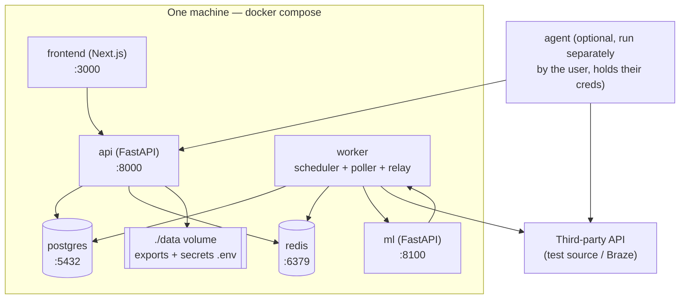
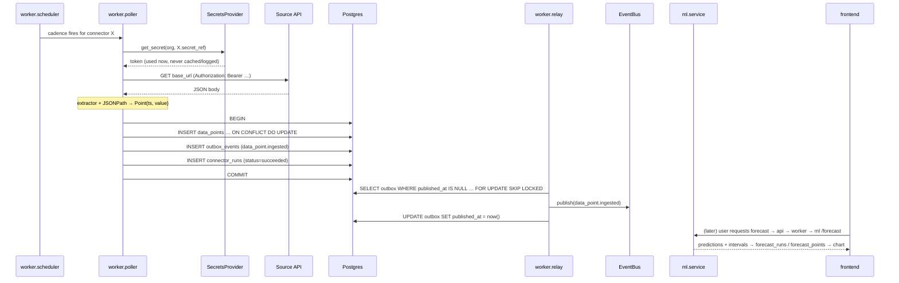

# Forecast Platform — Build Guide 1: Local / Open-Source Edition

> **Status: built.** This is the original build specification; the local
> edition it describes now exists and its architecture matches this document.
> For the current-state reference (including details that evolved during the
> build — the ml engine is now StatsForecast-based rather than
> pmdarima/prophet, the connector catalog grew live-API sources, anomaly
> detection and notifications shipped) see [`docs/`](docs/README.md). Where
> this file and `docs/` disagree, `docs/` is right.

> **Read this first.** This is the first of two build documents. It covers building and running the entire platform **locally**, as the open-source, self-hostable edition — the thing a community contributor clones and runs with one command. The second document (`02-deploy-production.md`) covers taking this same codebase to a hosted production deployment, and is deliberately written to be tackled **only after** everything here works. Do not read them out of order: the production doc assumes the local build exists and repeatedly refers back to it.
>
> This document is derived from and stays consistent with `forecast-platform-project-guide.md` (the master spec). Where this doc says "the guide," it means that file. Section numbers in cross-references (e.g. "guide §5.2") point there.

---

## 0. What this document is and isn't

**Is:** a concrete, opinionated walkthrough of how the code is structured, how the services talk to each other, and how someone runs the whole thing on a laptop with `docker compose up`.

**Isn't:** the product/market rationale (that's the guide), or the deployment topology (that's document 2). It also isn't a line-by-line tutorial — it's the architecture and the contracts, at the level an AI coding assistant or an experienced contributor needs to start writing real code without re-deciding settled questions.

**Design tension this document resolves:** the same codebase has to serve two masters — a hobbyist running it on a Raspberry Pi, and (later) a multi-tenant SaaS. The strategy throughout is *the local edition is the production edition with the managed pieces swapped for self-contained ones*, behind interfaces chosen so that swap is a config change, not a rewrite. Every place that split matters is called out explicitly.

---

## 1. Requirements this build satisfies

### Functional (local edition)
- Run every service on one machine via Docker Compose, no cloud account required.
- Configure a connector (generic REST + JSONPath), poll it on a schedule, accumulate a time series.
- Configure a push connector (webhook ingress) as an alternative to polling.
- Run the self-hosted **agent** against a source whose credentials never leave the user's machine.
- Request a forecast (SARIMA to start) and an EDA report for a metric.
- Export a forecast (CSV/JSON/XLSX) to the local filesystem.
- Do all of the above as a single implicit user — auth is present in the schema but not enforced locally by default.

### Non-functional
- **One command to run.** `docker compose up` and nothing else. This is the single most important adoption lever for an open-source project; treat any regression in it as a release blocker.
- **No mandatory paid dependency.** Everything in the default compose file is free and self-contained: Postgres, Redis, the three Python services, the frontend. No Supabase account, no cloud queue.
- **Runs on modest hardware.** Target: 1–2 vCPU, 2 GB RAM comfortably. Forecasting is CPU-bound but light (a SARIMA fit on a few thousand points is sub-second to a few seconds on one core).
- **Everything swappable via interface + config**, so the identical code runs against managed services in document 2.

### Constraints (carried from the guide)
- Solo maintainer, Python monorepo, few-weeks initial scope.
- Language: Python for `api`/`worker`/`ml`, TypeScript/Next.js for the frontend.
- The schema (guide §5) is fixed and is the contract both editions share.

---

## 2. The abstraction seams — the heart of the dual-edition strategy

Four things differ between "local" and "deployed." Each hides behind an interface so the difference is a swapped implementation selected by an environment variable, never a code fork. **If you internalize one thing from this document, make it this table.**

| Concern | Interface | Local implementation | Production implementation (doc 2) |
|---|---|---|---|
| Secrets | `SecretsProvider` (guide §7.3) | `.env` / `python-dotenv` (`DotenvSecretsProvider`) | Supabase Vault (`SupabaseVaultSecretsProvider`) |
| Object storage (exports) | `BlobStore` | Local filesystem volume (`LocalBlobStore`) | Supabase Storage (`SupabaseBlobStore`) |
| Event transport | `EventBus` | Redis Streams (`RedisEventBus`) — or in-process for the very first POC | Kafka / SQS-SNS (`KafkaEventBus`) |
| Auth | `AuthProvider` | Dev stub: a fixed implicit org/user (`LocalAuthProvider`) | Supabase Auth / JWT (`SupabaseAuthProvider`) |

The database is deliberately **not** in this table. Postgres is Postgres in both editions — local it's a container, in production it's Supabase's managed Postgres, but it's the same engine, same schema, same SQL, same migrations. That's a conscious choice: the guide (§5) already committed to Postgres specifically so the storage layer never needs a seam. Everything else that would tempt you toward a cloud-only primitive got an interface instead.

Selection is via a single `APP_EDITION` env var (`local` | `production`) plus per-concern overrides, resolved at startup by a small factory in `shared`. No service ever imports a concrete implementation directly; they depend on the interface and receive the concrete via dependency injection.

### 2.1 What the seam actually looks like in code

The pattern is small enough to show completely — this is the mechanism the entire dual-edition strategy rests on, so it's worth making concrete rather than hand-waving at "dependency injection":

```python
# shared/providers/event_bus.py
from typing import Protocol, Callable

class EventBus(Protocol):
    def publish(self, topic: str, payload: dict) -> None: ...
    def subscribe(self, topic: str, handler: Callable[[dict], None]) -> None: ...

# shared/providers/event_bus_redis.py
class RedisEventBus:                       # local implementation
    def __init__(self, url: str): ...
    def publish(self, topic, payload):     # XADD to a redis stream
        ...
    def subscribe(self, topic, handler):   # consumer group reading the stream
        ...

# shared/providers/event_bus_kafka.py
class KafkaEventBus:                        # production implementation (doc 2)
    ...                                     # same two methods, aiokafka under the hood

# shared/factory.py
def make_event_bus(settings) -> EventBus:
    match settings.event_bus_impl:          # defaults from settings.app_edition
        case "redis":  return RedisEventBus(settings.redis_url)
        case "kafka":  return KafkaEventBus(settings.kafka_brokers)
        case "inproc": return InProcessEventBus()   # first-POC shortcut
    raise ValueError(settings.event_bus_impl)
```

Every service receives its `EventBus` from `make_event_bus()` at startup and only ever calls `.publish()` / `.subscribe()`. The outbox relay (doc §6.2) that publishes `data_point.ingested` events has *no idea* whether it's talking to Redis or Kafka — which is precisely why moving to production touches zero lines of the relay. The same shape applies to `SecretsProvider`, `BlobStore`, and `AuthProvider`. When you write a new provider the rule is: implement the `Protocol`, add a `case` to the factory, done. If implementing a production provider ever forces a change to a *caller*, the interface was drawn in the wrong place — fix the interface, don't leak the implementation.

---

## 3. High-level design (local topology)



Note the worker is drawn as one box doing three jobs (scheduling, polling, outbox relay). Locally they're one process for simplicity; the code keeps them as separate modules/loops so production can split them into separate replicas without restructuring (doc 2, §on scaling).

### Data flow, the two ingestion paths

**Pull:** `worker` scheduler fires on a connector's cadence → poller fetches the source API (credential fetched from `SecretsProvider` at call time, never cached) → response normalized via JSONPath into `(metric_id, timestamp, value)` → upserted into `data_points` → an `outbox_events` row is written **in the same transaction** → relay loop publishes the event to the `EventBus`.

**Push:** third-party platform (or the agent) POSTs to `api`'s webhook ingress → validated against `connectors.webhook_token` (or the agent's hashed ingestion token) → same normalization → same upsert + outbox write. The two paths converge at the normalization step so nothing downstream knows or cares which one delivered the data.

Forecasting is decoupled from ingestion: a forecast is triggered either on demand (user clicks "forecast" in the UI → `api` enqueues a job) or on a schedule (`worker` emits forecast jobs). Either way `worker` calls `ml` over HTTP with the series, gets back predictions, writes `forecast_runs` + `forecast_points`. **`ml` never touches Postgres** — it's a pure function over its request body. That's the property that keeps it independently testable and independently scalable, and it's non-negotiable in both editions.

### 3.1 One data point, end to end

The prose above is the map; this is the territory. Following a single value from a scheduler tick to a rendered forecast is the fastest way to understand how the pieces actually interlock — and it doubles as the happy-path integration test worth writing first.



Three things this trace makes concrete that the prose only implies: the secret is read *inside* the poll and dies with the request; the data-point write, the outbox write, and the run-log write are **one transaction**, so a crash anywhere leaves no half-state; and the relay is a separate step, meaning event publishing can fail and retry without ever risking the data that's already safely committed. Every one of those properties carries into production unchanged — the boxes labelled `SecretsProvider` and `EventBus` just resolve to different implementations.

---

## 4. Repository layout

Consistent with guide §4.1, expanded with the local-run scaffolding:

```
/forecast-platform
  /services
    /api            FastAPI: auth, connector CRUD, webhook ingress, export, forecast-trigger
    /worker         scheduler + poller + outbox relay (separate modules, one process locally)
    /ml             FastAPI: /forecast, /eda  (stateless, no DB)
  /shared
    /models         Pydantic DTOs shared across services (the inter-service contracts)
    /db             SQLAlchemy models + Alembic migrations  (the guide §5 schema, verbatim)
    /providers      SecretsProvider, BlobStore, EventBus, AuthProvider — interfaces + impls
    /factory.py     resolves APP_EDITION + overrides into concrete providers
  /agent            standalone poller the user runs on their own box (own Dockerfile, own README)
  /frontend         Next.js app  (its own package.json / node toolchain)
  /connectors       connector definition YAML/JSON seeds (generic_rest, braze, ...)
  /docker
    docker-compose.yml            the one-command local stack
    docker-compose.agent.yml      the user-run agent, generated/pre-filled by the setup wizard
  /migrations       alembic env + versions  (hand-authored SQL — see §4.2)
  pyproject.toml    uv workspace root; members = services/* and shared
  uv.lock           single lockfile for the whole Python workspace
  .env.example      every knob, documented, with local-safe defaults
  Makefile          make up / make seed / make test / make migrate
  README.md         quickstart: clone, cp .env, docker compose up
```

Each `services/*` and `shared` has its own `pyproject.toml` declaring its deps; the root `pyproject.toml` ties them into one **uv workspace** so `shared` is consumed as a path dependency and the whole thing resolves to a single `uv.lock`. Two deliberate calls: connector definitions live as **seed data** (`/connectors`) loaded into `connector_definitions` at startup, not as code — that's the guide's "connectors are data, not schema" principle made real, and it means a contributor adds a new source with a YAML file + a small extractor, not a migration. And the agent is its **own** self-contained subtree with its own README and Dockerfile, because it's the one artifact users run outside the compose stack and it must be independently understandable (and independently auditable — guide §7.7).

### 4.0 Python toolchain & packaging

- **uv workspace**, one workspace rooted at the repo, with `services/api`, `services/worker`, `services/ml`, and `shared` as members. `shared` is a path dependency of the three services; one `uv.lock` governs everything, so a contributor runs `uv sync` once and every service is installed consistently. This is the 2026-standard shape for a Python monorepo and it's fast to restore in Docker layers.
- **Python 3.12 pinned for the service images**, not 3.13. `pmdarima` and `prophet`/`cmdstanpy` against numpy 2.x are a known pain surface on 3.13; 3.12 is where the scientific stack is fully settled in mid-2026. A contributor's host may run 3.13 — that's fine, the containers pin 3.12 and that's what governs reproducibility. Every dependency is **exact-pinned** (via `uv.lock`), not floated, because the forecasting stack is the part most sensitive to silent version drift.
- Per-service Dockerfiles do `uv sync --frozen --package <service>` so each image contains only that service's dependency closure plus `shared` — the `ml` image gets statsmodels/pmdarima/prophet; the `api` image doesn't, keeping it lean.

### 4.2 Migrations: SQL-first, models as a mapping layer

The schema (guide §5) is defined by **hand-authored SQL migrations**, not by autogenerate. This is a deliberate ownership decision, because RLS policies, declarative partitioning, `pg_partman`, `pgcrypto`, the composite natural keys, and the `auth` shim (§12.2) are all things `alembic revision --autogenerate` cannot produce correctly — fighting it to emit this schema is more work than writing the DDL directly.

- Migrations use Alembic as the *runner*, with the DDL written explicitly (`op.execute(...)` for everything autogenerate can't express, which here is most of it). The §5 DDL is the source of truth.
- SQLAlchemy models exist as a **typed query layer that mirrors** the tables, hand-maintained to match. They are not the schema authority; **never** autogenerate from them. Treat a divergence between models and migrations as a bug in the models.
- Practical consequence: adding a column is a two-step discipline — write the migration, then update the model to match — rather than one autogenerated step. For a schema this dependent on Postgres features ORMs can't model, that discipline is the cheaper path.

### 4.1 What a connector definition actually is

The claim "connectors are data, not code" is only credible if you can see the data. Here's the generic REST connector as a seed file — the thing a contributor copies to add a new source:

```yaml
# connectors/generic_rest.yaml  →  loaded into connector_definitions at startup
key: generic_rest
name: Generic REST API
description: Poll any REST endpoint and pull a numeric value out of the JSON response.
supports_pull: true
supports_push: false
supports_agent: true
# config_schema drives BOTH the setup-wizard form fields AND server-side validation.
config_schema:
  type: object
  required: [base_url, value_path]
  properties:
    base_url:    { type: string, title: "API URL", format: uri }
    auth_header: { type: string, title: "Auth header name", default: "Authorization" }
    auth_scheme: { type: string, title: "Scheme", default: "Bearer", enum: ["Bearer", "Basic", "raw"] }
    value_path:  { type: string, title: "JSONPath to the metric value", examples: ["$.data.count"] }
    timestamp_path: { type: string, title: "JSONPath to the timestamp (optional)" }
```

The single `config_schema` (JSON Schema) is load-bearing in three places at once: the frontend renders it into the wizard form, the `api` validates submitted config against it, and it documents the connector for contributors. A source-specific connector (say `braze.yaml`) is the same file with `base_url` pinned, `supports_push: true`, and Braze-shaped defaults.

The only *code* a new connector needs is an extractor, when the generic JSONPath path isn't enough:

```python
# services/worker/connectors/generic_rest.py
class GenericRestExtractor:
    def fetch(self, config: dict, secret: str | None, cadence: str) -> list[Point]:
        resp = http_get(config["base_url"],
                        headers=self._auth(config, secret))   # secret injected here, never stored
        value = jsonpath(config["value_path"], resp.json())
        if config.get("timestamp_path"):
            ts = jsonpath(config["timestamp_path"], resp.json())
        else:
            ts = quantize_to_cadence(now(), cadence)   # NOT raw now() — see idempotency note below
        return [Point(timestamp=ts, value=float(value))]
```

**Idempotency note:** when the source doesn't provide a timestamp, the extractor stamps the point with `now()` *quantized to the connector's cadence bucket* (top of the hour for an hourly connector, midnight for a daily one), not raw `now()`. Without this, a retried poll a few seconds later would produce a *different* timestamp and the `(metric_id, timestamp)` upsert (guide §5.2) would create a near-duplicate point instead of deduping. Quantizing restores the idempotency guarantee for the timestamp-absent path.

Registered by `key`, so the poller looks up the extractor for a connector's definition and calls `fetch()`. That's the whole extension surface: one YAML file, optionally one small class. This is what "few weeks to a differentiated product" depends on — the connector-writing effort the guide (§ market analysis) warns is the *real* hard part of this category is contained to exactly these two artifacts.

---

## 5. Deep dive: the inter-service contracts

These are the API contracts that matter. Keep them stable; they're what let the services stay loosely coupled.

### 5.1 `ml` service — the stateless forecasting core

`POST /forecast`
```jsonc
// request
{
  "series": [{"timestamp": "2026-06-01T00:00:00Z", "value": 42.0}, ...],
  "horizon": 24,
  "model": "auto",                // "auto" | "sarima" | "ets" | "prophet"
  "seasonal_period": 24,          // m; null = auto-detect or treat as non-seasonal
  "model_params": {}              // optional manual order override; empty = auto-selected
}
// response
{
  "model": "sarima",             // the model actually used (may differ from request if it fell back)
  "model_params": {"order": [1,1,1], "seasonal_order": [0,1,1,24]},
  "points": [{"timestamp": "...", "predicted": 43.1, "lower": 40.2, "upper": 46.0}, ...],
  "warning": null                 // e.g. "series too short for SARIMA, used ETS" when a fallback fired
}
```

`POST /eda`
```jsonc
// request: { "series": [...] }
// response: { "stationarity": {...}, "seasonality": {...}, "acf_pacf": {...} }
```

That's the whole surface. `ml` is a pure computational service — same input always yields same output, no DB, no auth, no state. This is what makes it trivially horizontally scalable later (doc 2) and easy to unit-test now (feed it a known series, assert on the forecast shape). Order selection uses `pmdarima`'s `auto_arima` by default rather than a hand-rolled implementation; the seasonal period, minimum-series-length rules, short/missing-data handling, and model-fallback ladder are specified in full in **`03-forecasting-and-ml-service.md`** — that document is the authoritative spec for everything behind these two endpoints, and it turns this contract into real code.

### 5.2 `api` service — the frontend's entire backend

Representative endpoints (all tenant-scoped in production via `AuthProvider`; locally the implicit org is injected):
- `POST /connectors`, `GET /connectors`, `PATCH /connectors/{id}` — connector config CRUD
- `POST /connectors/{id}/metrics`, `GET /metrics/{id}/data` — metric config + series retrieval
- `POST /webhooks/{webhook_token}` — push ingress (no auth header; the token in the path is the credential)
- `POST /metrics/{id}/forecast` — enqueue a forecast job by inserting a `forecast_runs` row with `status='pending'`; returns its id to poll (mechanism pinned in §5.4)
- `GET /forecasts/{id}` — forecast result (frontend polls this for `completed`)
- `GET /forecasts/{id}/export?format=csv|json|xlsx` — export (guide §6)
- `POST /agents` — register an agent, returns the one-time ingestion token + a pre-filled compose file

### 5.4 How a forecast job is dispatched — pinned

There are three plausible dispatch mechanisms the earlier drafts left ambiguous (a `pending`-row queue, the Redis `EventBus`, or Celery). **Decision: the `forecast_runs` row is the job.** No second mechanism.

- `api` inserts `forecast_runs (status='pending', ...)` and returns the id.
- `worker` polls `SELECT ... FROM forecast_runs WHERE status='pending' ORDER BY requested_at FOR UPDATE SKIP LOCKED LIMIT n`, flips each to `running`, calls `ml`, writes `forecast_points`, sets `completed` (or `failed` + `error_message`).
- The frontend polls `GET /forecasts/{id}` until `status` is terminal.

Rationale: `forecast_runs` already models the full job lifecycle (`pending→running→completed→failed`), so the row *is* the durable job record — adding an EventBus message or a Celery task to track the same work would be redundant state to keep in sync. The `EventBus` stays scoped to `data_point.ingested` fan-out (§6.3); it is deliberately **not** the forecast-dispatch channel. `FOR UPDATE SKIP LOCKED` makes this correct with one worker locally and N workers in production, unchanged — the same concurrency property as the outbox relay. If sub-second dispatch latency is ever needed, graduating to Celery is a localized change behind the same `api`/`worker` boundary; the MVP's 1–2s poll interval is fine.

### 5.3 The ingestion contract (agent → api, and webhook → api)

Both the agent and push sources speak the same minimal ingest shape:
```jsonc
POST /ingest        // agent uses this with its bearer token
POST /webhooks/{token}   // push sources use this
{
  "metric_key": "signups_hourly",     // resolved to a metric_id via metrics.key, unique per connector
  "points": [{"timestamp": "...", "value": 128}, ...]
}
```
The agent only ever sends numbers — never the source credential (guide §7). `metric_key` resolves to a `metric_id` through the `metrics.key` column + its `UNIQUE (connector_id, key)` constraint (schema addendum §12.1) — `name` stays the human label, `key` is the stable slug. This contract is intentionally dumb so that writing a new agent connector, or pointing a random script at the webhook, is trivial.

---

## 6. Deep dive: how each concern works locally

### 6.1 Scheduling (worker)
`APScheduler` with a Postgres jobstore. On startup, `worker` loads all `pull` connectors and registers a job per connector at its `schedule_cron`. Local default cadences can be fast (every minute) for a good demo loop; document that in `.env.example`. The guide flags that `APScheduler` gives way to Celery beat once schedules are dynamic and numerous — locally you will never hit that, so it stays simple here and the migration note lives in doc 2.

### 6.2 The outbox relay (worker)
A loop: `SELECT ... FROM outbox_events WHERE published_at IS NULL ORDER BY created_at LIMIT n FOR UPDATE SKIP LOCKED`, publish each to the `EventBus`, set `published_at`. `SKIP LOCKED` means you can run more than one relay without double-publishing — irrelevant locally (one process) but the code is written for it so production gets multi-replica safety free. Guide §5.6 is the rationale.

### 6.3 Events (EventBus → Redis Streams locally)
Redis is already in the stack for the APScheduler/Celery future and for caching, so Redis Streams is the zero-extra-dependency local event transport. `RedisEventBus` implements publish/subscribe over a stream. For the very first POC you may even use an in-process bus and skip Redis entirely; the interface makes that a one-line factory change. In production this becomes Kafka or SQS/SNS with **no change to any publishing or consuming code** — that's the entire point of the seam.

### 6.4 Secrets (DotenvSecretsProvider)
Reads from a gitignored `.env` (or a mounted secrets file). `get_secret(tenant, key)` returns the value; `put_secret` writes back for the dev flow of adding a connector through the UI. For contributors who want at-rest encryption even locally, the guide's `sops`+`age` note applies. The critical invariant, identical in both editions: **the value is fetched at the moment of the poll and never logged** — enforce it here so it's habit before production.

### 6.5 Exports & blob storage (LocalBlobStore)
Export files are written to a mounted `./data/exports` volume; the "shareable link" is a local URL with the `share_token`. Async large-export path still works locally (job → worker → file appears → notification), just against the filesystem instead of Supabase Storage.

### 6.6 Auth (LocalAuthProvider)
Returns a fixed org/user for every request so the whole app is usable with zero login friction — the right default for someone evaluating the project. RLS policies exist in the schema but, with a single implicit org, they're effectively inert locally. A `MULTI_TENANT=true` local flag can turn on real Supabase-style auth for contributors working on that path. This means the self-hosted edition is genuinely single-tenant-simple by default, which is what a self-hoster actually wants.

**The `auth.users` FK problem, resolved.** Half a dozen tables FK to `auth.users(id)` — a table Supabase provides but a plain local Postgres container does not, so a naive `alembic upgrade` would fail locally on those constraints. The fix (schema addendum §12.2): the **first migration creates a minimal `auth` schema + `auth.users` shim guarded with `IF NOT EXISTS`**, so it's a no-op on Supabase (where the real, richer table already exists) and creates just enough locally for the FKs to resolve. `make seed` inserts the `LocalAuthProvider`'s fixed user into it. This keeps the schema *identical* across editions — the alternative (conditional FKs) would make the two editions structurally different, exactly what the seam strategy exists to avoid.

---

## 7. Error handling & reliability (local, but written for production)

- **Failed polls** write a `connector_runs` row with `status='failed'` and the error; after N consecutive failures the connector flips to `status='error'` and a `notification` is raised. Same code path in both editions.
- **Ingestion is idempotent** by construction — the `(metric_id, timestamp)` upsert (guide §5.2) means a retried poll or redelivered webhook can never duplicate a point.
- **The outbox guarantees at-least-once** event delivery; consumers must be idempotent. Write them that way from day one even though the local single-process path rarely redelivers.
- **`ml` failures** are just HTTP errors the worker retries with backoff; a permanently failing forecast marks the `forecast_run` `failed` with the message, surfaced in the UI.

---

## 8. Running it — the contributor's actual experience

```bash
git clone <repo> && cd forecast-platform
cp .env.example .env          # local-safe defaults already filled in
make up                       # docker compose up: pg, redis, api, worker, ml, frontend
make seed                     # loads connector_definitions + a demo REST connector
# open http://localhost:3000 — add a metric, watch data accumulate, request a forecast, export it
```

The demo connector polls the api's own `/dev/sample-metric` endpoint, which the
worker's SSRF guard would normally reject as a non-public host. The guard's
`CONNECTOR_ALLOW_PRIVATE_HOSTS` knob therefore defaults **true when
`APP_EDITION=local`** (a trusted self-hosted install) and **false in
production**; set it explicitly to override either way (see `.env.example`).

Running the agent (the credential-isolation path) is a separate, documented step:
```bash
# after registering an agent in the UI, it hands you a pre-filled file:
docker compose -f docker-compose.agent.yml up   # you add only your source API key
```

Acceptance for "the local edition works": a fresh clone reaches a rendered forecast and a downloaded CSV using only the commands above, on a 2 GB machine, with no cloud account. That is the release gate for the open-source edition and the precondition for opening document 2.

---

## 9. Scale & reliability notes (what's deliberately deferred to doc 2)

Everything here is single-node by design. The following are **not** solved locally and are the substance of the deployment document — listed here so the boundary is explicit:
- Horizontal scaling of `worker` (multi-replica poller/relay) and `ml` (parallel forecasting).
- Managed Postgres, connection pooling (Supavisor session mode), PITR, read replicas.
- Real queue infrastructure (Kafka/SQS-SNS) behind the same `EventBus` interface.
- Real multi-tenant auth + RLS enforcement, Supabase Vault secrets, Supabase Storage exports.
- The always-on container host for `api`/`worker`/`ml` and Vercel for the frontend.

Because every one of those sits behind a seam established in §2, none of them require touching business logic — they're configuration and infrastructure, which is exactly why they belong in a separate document you open only once this one is done.

---

## 10. Trade-offs made in this design

- **One worker process locally vs. three services:** simpler to run and reason about; the cost is that the scheduler, poller, and relay share a process and could contend. Accepted because local scale is tiny and the module boundaries preserve the future split.
- **Redis Streams as the local bus:** not a "real" broker, but zero extra dependency and sufficient for one node. The `EventBus` seam means this opinion is cheap to reverse.
- **Auth off by default locally:** maximizes evaluation friendliness at the cost of the local path exercising RLS less. Mitigated by the `MULTI_TENANT=true` flag for contributors on that path.
- **Shared Postgres across services:** a "shared database" anti-pattern in strict microservice terms, but the guide's discipline (only `api`/`worker` write; `ml` is stateless) keeps coupling low, and a single Postgres is dramatically simpler for a self-hoster than a database-per-service split that this scale doesn't warrant.

## 11. What I'd revisit as it grows
- If contributors frequently add connectors, promote connector definitions from seed files to a small plugin API with its own tests.
- If the single worker process becomes a local bottleneck for people running hundreds of metrics, document splitting it even in the compose file (it's already module-separated).
- If `ml` cold-start (loading statsmodels/prophet) hurts the demo loop, add a warm-pool or keep-alive note.

---

## 12. Schema addenda (resolved gaps against guide §5)

Three concrete schema changes were resolved after review; they belong in the master guide's §5 but are recorded here as the authoritative statement for this build, and `03`/`04` depend on them.

### 12.1 `metrics` gains a stable key and a seasonal period

```sql
ALTER TABLE metrics ADD COLUMN key TEXT NOT NULL;
ALTER TABLE metrics ADD COLUMN seasonal_period INTEGER;   -- m: 24 hourly/daily, 7 daily/weekly; NULL = auto/none
ALTER TABLE metrics ADD CONSTRAINT uq_metric_key UNIQUE (connector_id, key);
```

- `key` is the stable slug the ingest contract (§5.3) resolves against — `name` remains the human-facing label. Unique per connector (and connectors are unique per org), so `metric_key` in an ingest payload maps to exactly one `metric_id`.
- `seasonal_period` is where the SARIMA `m` comes from. It's **per-metric config, not inferred from poll cadence** — polling hourly doesn't tell you whether the real seasonality is daily (24) or weekly (168). `NULL` means the `ml` service auto-detects or treats the series as non-seasonal. Full rules in `03`.

### 12.2 The `auth.users` shim (first migration)

```sql
-- migration 0001, before any table that FKs auth.users
CREATE SCHEMA IF NOT EXISTS auth;
CREATE TABLE IF NOT EXISTS auth.users (
    id    UUID PRIMARY KEY DEFAULT gen_random_uuid(),
    email TEXT
);  -- Supabase's real auth.users has many more columns; we only ever FK to id, so this shim suffices
```

`IF NOT EXISTS` makes this inert on Supabase (real table already present) and creates the minimal shim locally so the FKs resolve. Identical schema both editions; no conditional FKs.

### 12.3 Migration ordering

Because of the above, migration order is: `0001` extensions (`pgcrypto`) + `auth` shim → `0002` core tables (guide §5.2) → `0003` team/billing/ops tables (§5.5) → `0004` outbox + anomalies/LLM (§5.6–5.7) → `0005` RLS policies → `0006` partitioning + `pg_partman` setup. RLS and partitioning come last because they depend on the tables existing, and they're the ops autogenerate can't produce (§4.2).

---

## 13. Architecture Decision Records

The trade-off bullets above summarize; these ADRs capture the two decisions consequential enough that a future contributor will want the full reasoning before overturning them. Format is deliberately lightweight so more can be added as the project makes real decisions.

### ADR-001: Provider-seam pattern for dual-edition support

**Status:** Accepted · **Date:** 2026-07 · **Deciders:** maintainer

**Context.** The same codebase must run as a zero-dependency local app *and* a managed-cloud SaaS. The naive options are a hard fork (two codebases) or littering the code with `if cloud:` branches. Both rot quickly for a solo maintainer.

**Decision.** Isolate each environment-specific concern (secrets, blob storage, event transport, auth) behind a `Protocol`, select the implementation at startup via a factory keyed on `APP_EDITION` (doc §2, §2.1). Postgres is explicitly excluded from the seam because it's identical in both editions.

**Options considered.**

| Option | Complexity | Maintainability | Verdict |
|---|---|---|---|
| Hard fork per edition | Low upfront | Terrible — every feature written twice | Rejected |
| Inline `if edition ==` branches | Low | Poor — logic tangled with wiring, untestable | Rejected |
| Provider seam + factory | Medium upfront | Strong — one code path, swap at edges | **Chosen** |

**Consequences.** *Easier:* a single code path to test and reason about; production deploy becomes config, not code (the entire premise of doc 2). *Harder:* a small discipline tax — contributors must resist calling cloud SDKs directly and instead go through interfaces. *Revisit if:* a concern needs edition-specific *behavior* (not just a different backend), at which point the interface may need to widen or that concern may warrant genuine divergence.

### ADR-002: Redis Streams as the local event transport

**Status:** Accepted · **Date:** 2026-07 · **Deciders:** maintainer

**Context.** The outbox relay needs an `EventBus` to publish to locally. Redis is already in the stack (caching, future Celery). The production bus will be Kafka or SQS/SNS (deferred to doc 2, ADR in that file).

**Decision.** Use Redis Streams (`RedisEventBus`) as the default local implementation, with an `InProcessEventBus` escape hatch for the first-POC single-process case.

**Options considered.** Running Kafka locally (rejected: heavy, undermines the "runs on 2 GB" and "one command" promises); a pure in-process bus only (rejected: doesn't exercise real publish/subscribe semantics, so bugs only surface in production); **Redis Streams (chosen):** zero *additional* dependency, real consumer-group semantics that mirror a broker closely enough to catch integration bugs locally.

**Consequences.** *Easier:* contributors get realistic event behavior with nothing new to install. *Harder:* Redis Streams isn't a perfect Kafka analog (no partitions/retention tuning), so a thin class of broker-specific behavior is only truly tested in production. *Revisit if:* the local↔production semantic gap ever causes a bug that local testing should have caught — then consider a Kafka-compatible lightweight local broker (e.g. Redpanda) in the compose file.

---

**Next:** once a fresh clone passes the §8 acceptance gate, proceed to `02-deploy-production.md`.
