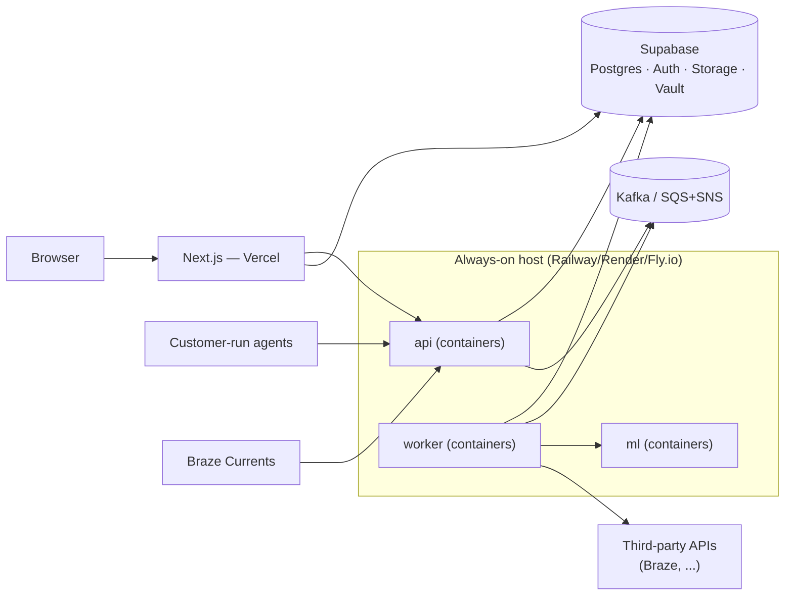

# Forecast Platform — Build Guide 2: Production / Deployed Edition

> **Prerequisite: `01-build-local-opensource.md` must be done first.** This document assumes the local edition exists, runs, and passes its acceptance gate (doc 1, §8). It does not re-explain the architecture, the service contracts, or the schema — it explains what *changes* to take that same codebase to a hosted, multi-tenant, always-on production deployment. If a fresh clone doesn't yet reach a rendered forecast locally, stop and finish document 1.
>
> Like document 1, this stays consistent with `forecast-platform-project-guide.md` (the master spec, "the guide"). It is essentially an expansion of guide §10 with the operational depth needed to actually ship.

---

## 0. The core promise this document cashes in

Document 1 built every cloud-specific concern behind an interface (doc 1, §2): secrets, blob storage, event transport, and auth each have a `local` implementation and a `production` implementation, selected by `APP_EDITION`. **Deployment is therefore mostly configuration, not new business logic.** The value of this document is getting that configuration, the hosting topology, and the operational safeguards right — because those are the parts that don't show up locally and that bite in production.

If at any point deploying seems to require rewriting business logic, that's a signal a seam was missed in document 1 — fix it there, not here.

---

## 1. Requirements specific to production

### Functional additions over local
- Real multi-tenancy: many organizations, isolated, with real auth and enforced RLS.
- Billing state (Stripe) gating plan tiers.
- Always-on ingestion: the `worker` runs continuously, independent of any user being logged in.
- Public webhook ingress reachable by third-party platforms (e.g. Braze Currents).

### Non-functional (the ones that only exist once deployed)
- **Availability:** survive a service restart, a deploy, and a Postgres failover without losing data or silently dropping polls. Recoverable to a point in time.
- **Cost:** stay within the "under $50–100/month for the first hundred customers" envelope the guide established, because forecasting is cheap and storage is small.
- **Scale path:** handle growth in *number of metrics × poll frequency* by adding worker/ml replicas, not by re-architecting.
- **Security:** third-party credentials protected in transit and at rest; the app's own database breach must not, by itself, expose them.

---

## 2. The chosen stack (guide §10.1) and the one constraint that shapes everything

| Layer | Provider | Role |
|---|---|---|
| Frontend | **Vercel** | Next.js hosting |
| Postgres + Auth + Storage + Secrets | **Supabase** | Managed DB, Auth, Storage, Vault |
| `api`, `worker`, `ml` | **Always-on container host** — Railway / Render / Fly.io | Persistent backend processes |
| Event queue | Managed Kafka (Confluent/Upstash) or AWS SQS+SNS | Behind the `EventBus` interface |

**The constraint that dictates the whole topology (guide §10.2):** Vercel and Supabase are both fundamentally serverless. Neither can host the `worker`, because `worker` must run *continuously* and hold an open connection to a queue — not wake on invocation. Vercel Functions cap out around 800 seconds even on paid tiers; Supabase Cron is fire-and-forget with a ~10-minute ceiling, no retries, and it only runs while the database is healthy. So `worker` (and alongside it `api` and `ml`) live on a **real always-on container host**, and Vercel/Supabase do only what they're each good at. This is not a preference; it's the reason the third hosting row exists.

---

## 3. Production topology

The service *code* is identical to doc 1. What changed: Postgres is Supabase's; the `EventBus` points at real queue infra; secrets resolve to Supabase Vault; storage to Supabase Storage; auth to Supabase Auth. All via `APP_EDITION=production` + provider overrides.

---

## 4. The provider swaps, concretely

Each row is the production implementation of an interface already defined and exercised locally (doc 1, §2 and §6).

### 4.1 Secrets → `SupabaseVaultSecretsProvider` (guide §7.4)
Third-party credentials live in Supabase Vault, encrypted at rest, referenced from `connectors.secret_ref` — never stored as plaintext in any table. `worker` fetches at poll time, never caches, never logs (the invariant you already enforced locally). Every access writes an `audit_log` row (guide §5.5) so credential-usage anomalies are detectable — the guide notes this is itself a time-series anomaly problem you can dogfood later.

### 4.2 Event transport → `KafkaEventBus` (or SQS+SNS)
The outbox relay and all consumers are unchanged; only the `EventBus` implementation and connection string differ. **Decide the broker before this step** (guide §12 open question): managed Kafka (Confluent/Upstash) is closer to the guide's "event listener supporting SNS/SQS or Kafka" language and portable to the OSS edition; AWS SQS+SNS is cheaper and simpler if you're already on AWS but couples you to it. Either sits behind the same interface, so the choice is reversible in code but has real ops/cost consequences — make it deliberately.

### 4.3 Storage → `SupabaseBlobStore`
Export files land in a Supabase Storage bucket; shareable links become signed, expiring Storage URLs (guide §6.2). The async large-export path is unchanged from local.

### 4.4 Auth → `SupabaseAuthProvider` + RLS turned live
This is the biggest behavioral change from local. Supabase Auth issues JWTs; `api` validates them and resolves the org. **RLS stops being inert.** Every tenant-owned table's policy (guide §5.4) now actively enforces isolation. Two hard rules from Supabase's own production guidance:
- **Test the policies, not just the code.** RLS bugs are silent. Write tests asserting "user in org A cannot read org B's rows" so a future policy edit can't quietly open a hole.
- **The service-role key is server-only.** It bypasses RLS by design; it must live in the container host's secret store, never in the frontend bundle, never in git. The frontend uses only the anon key.

---

## 5. The database in production (guide §5.8)

Same schema, same migrations (Alembic runs forward against Supabase), but now with the availability levers that don't exist locally. Two notes carried from doc 1: migrations are **hand-authored SQL, not autogenerated** (doc 1 §4.2), so RLS/partitioning/`pg_partman` are expressed explicitly; and the `auth.users` shim migration (doc 1 §12.2) is **inert here** — its `IF NOT EXISTS` guards no-op against Supabase's real `auth.users`, so the same migration set runs unchanged in both editions.

The availability levers themselves:

- **Connection pooling — Supavisor in *session* mode (port 5432).** Because `api`/`worker`/`ml` are long-lived containers, session mode is correct; transaction mode is for serverless/edge callers, which these are not. Getting this one setting wrong is the classic "worked in dev, fell over in prod" Supabase incident. The frontend's own direct Supabase calls (if any) can use the transaction-mode pooler since they're request-scoped.
- **Point-in-Time Recovery — enable the add-on now,** before real customer data exists. It's opt-in, not automatic. This is the difference between "we can roll back the bad migration" and "we restore last night's backup and lose a day."
- **Partitioning + `pg_partman`.** Turn on the automated monthly partition management for `data_points` and `connector_runs` (guide §5.3) and schedule `pg_partman`'s maintenance via Supabase Cron — this is exactly the kind of lightweight pure-DB maintenance Supabase Cron *is* suited for (unlike the core pipeline, which it is not). Note TimescaleDB is not the answer here — Supabase deprecated it; `pg_partman` is the supported path.
- **Read replica — a lever held in reserve.** Not day one. If continuous polling writes start contending with dashboard reads, point read-heavy `api` queries at a replica while `worker` writes to the primary. No schema change needed thanks to the existing service separation.

---

## 6. Scaling each service

The workload profile (guide): CPU-bound but light forecasting, I/O-bound polling, small dense storage. Scaling is about concurrency of many small jobs, not big-compute.

- **`ml` — scale horizontally, freely.** It's stateless (doc 1, §5.1); run N replicas behind the host's load balancer. Forecast jobs are independent per metric, so this parallelizes linearly. This is the safety valve if forecast latency ever rises. Dispatch is the `forecast_runs.status='pending'` queue polled with `FOR UPDATE SKIP LOCKED` (doc 1 §5.4), so adding worker replicas that claim pending runs is safe with no new infrastructure — the same concurrency primitive as the outbox relay.
- **`worker` — split the co-located loops.** Locally, scheduling + polling + relay share one process. In production, run them as separate deployments: multiple poller replicas (partition connectors across them), and multiple relay replicas made safe by the `FOR UPDATE SKIP LOCKED` you already wrote (guide §5.6). The scheduler stays singleton (or leader-elected) to avoid duplicate job emission.
- **`api` — scale horizontally,** ordinary stateless web tier; watch the Supabase connection budget (§5) so replicas don't exhaust the pool — this is what Supavisor is protecting against.
- **Scheduling at scale** (guide §12): `APScheduler` was fine locally; once schedules are numerous and per-tenant, migrate to Celery beat with dynamically loaded periodic tasks. Do this deliberately when the pain appears, not preemptively.

---

## 7. Reliability & operations

- **Deploys must not drop data.** Ingestion idempotency (the `(metric_id, timestamp)` upsert) plus the outbox mean a mid-deploy restart is safe: unpublished outbox rows are picked up after restart; in-flight polls either completed (and upserted) or didn't (and will re-run). Nothing to reconcile by hand.
- **Health checks & heartbeats.** Each service exposes `/healthz`. The container host restarts unhealthy instances. Agents report heartbeats into the `agents` table; a lapsed heartbeat raises an `agent_unreachable` notification (guide §5.5).
- **Failure surfacing.** `connector_runs` gives every poll an audit row; repeated failures flip the connector to `error` and notify the owner. This is the same code as local — it just matters more now.
- **Monitoring.** Export logs/metrics (Supabase can ship logs to Datadog/Grafana/Sentry; the container hosts have their own metrics). Watch: connection-pool utilization (keep headroom so Auth/Storage aren't starved), outbox lag (`published_at IS NULL` growing = relay falling behind), forecast latency, poll failure rate.
- **Backups/DR.** PITR covers Postgres. Supabase Storage holds only regenerable export artifacts, so it's not on the critical recovery path. Secrets in Vault should be part of your documented recovery runbook.

---

## 8. Security posture in production (guide §7)

- Credential-custody preference order is unchanged and is a *product* stance, not just an ops one: **push (no credential) > agent (customer holds it) > server-side pull (Vault).** Most of the "hard" secret-handling only applies to the minority of sources that force server-side pull.
- Vault + `secret_ref` means an application-DB breach yields ciphertext-free pointers, not keys.
- The multi-tenant hardening the guide flags for the SaaS stage (§7.5) — per-tenant envelope encryption keys, credential-access anomaly monitoring, instant revocation from the dashboard — layers on here without schema change (`audit_log` and `api_keys` already exist).
- Agents remain outbound-only, non-root, signed images (guide §7.7); nothing about deployment weakens that.

---

## 9. The cutover checklist (guide §10.4, operationalized)

Ordered, and safe to do incrementally:

1. **Supabase project:** provision; run Alembic migrations forward; enable PITR; enable `pg_partman` + schedule its maintenance; confirm Supavisor **session-mode** connection strings for the backend.
2. **Secrets:** move any real credentials into Vault; set `APP_EDITION=production` and the secrets override so `SupabaseVaultSecretsProvider` is active. No app code change (doc 1, §2).
3. **Queue:** stand up the chosen broker; point `EventBus` at it; verify the outbox relay publishes and a consumer receives.
4. **Backend host:** deploy `api`, `worker` (split into scheduler/poller/relay deployments), and `ml` (multi-replica) as always-on containers from the monorepo; wire `/healthz`.
5. **Frontend:** deploy Next.js to Vercel; point it at the deployed `api`; anon key only in the client, service-role key only server-side.
6. **Auth/RLS:** flip on `SupabaseAuthProvider`; run the RLS isolation test suite (§4.4) and confirm cross-org reads fail.
7. **The one thing to verify above all (guide §10.4.5):** that `worker` holds a *stable, persistent* connection to the queue and keeps polling with no user logged in — this is the exact capability Vercel/Supabase can't provide and the whole third-host decision exists to guarantee. Watch it survive a deliberate restart.

---

## 9a. What this actually costs

The guide keeps asserting "under $50–100/month for the first hundred customers." Here's the arithmetic behind that claim, so it's a budget you can defend rather than a hopeful number. Figures are order-of-magnitude for early stage; verify current pricing at signup since tiers shift.

| Line item | Early-stage tier | Rough monthly |
|---|---|---|
| Supabase | Pro (needed for PITR add-on, daily backups, more compute) | ~$25 + PITR add-on |
| Container host (api + worker + ml) | Railway/Render/Fly small instances; a few shared-CPU containers | ~$15–40 |
| Queue | Upstash Kafka pay-per-message or SQS/SNS free-tier-ish at low volume | ~$0–15 |
| Vercel | Hobby → Pro when you need it | $0–20 |
| **Total** | | **~$40–100** |

The reason this stays cheap is structural, not lucky: forecasting is CPU-light and bursty (so small shared-CPU containers suffice), and time-series storage is dense (the guide notes even 10k users × dozens of metrics × years of hourly data lands in tens of GB, not terabytes). The cost model only breaks if you add always-hot GPU inference — which is exactly why the guide fences the shared-global-model / LLM work off into later, opt-in stages rather than the core loop. Watch two cost drivers as you grow: Supabase compute (the first thing you'll outgrow) and queue message volume (scales with metrics × poll frequency, so a flood of hourly connectors moves this line first).

## 9b. Choosing the container host

All three named hosts (Railway, Render, Fly.io) run long-lived Docker containers from the monorepo and fit the budget. The differences that actually matter for *this* app:

| | Railway | Render | Fly.io |
|---|---|---|---|
| Mental model | "just deploy the repo" | classic PaaS, explicit services | run containers close to regions |
| Best when | fastest path to running | you want clear service/cron separation | you'll want multi-region / edge later |
| Watch out for | usage-based bill can surprise | cold starts on cheapest tier | more infra concepts to learn |

Recommendation for day one: **Railway or Render** for lowest operational friction while you're solo — the "run the repo and move on" property is worth more than Fly's regional flexibility, which is a v-later concern. Fly earns its place specifically when latency-to-source-API or data-residency becomes a real requirement. This is a low-stakes, reversible choice (it's just a container host); don't over-deliberate it.

---

## 10. Trade-offs & what to revisit

- **Three hosting providers (Vercel + Supabase + container host) instead of one.** More surface to operate, but each does what it's best at, and the alternative (forcing an always-on worker onto serverless) doesn't actually work. Accepted deliberately.
- **Managed everything early.** Costs a little more than raw VMs but keeps a solo maintainer focused on product, not ops — and stays within the cost envelope because the workload is light. Revisit only if scale makes managed pricing dominate.
- **Kafka vs SQS/SNS left open until §4.2.** Genuinely a fork in portability vs. simplicity; the interface makes it reversible in code but not free in ops. Decide before scaling, not after.
- **Shared Postgres, single primary.** Fine to a large scale for this workload; the read-replica lever (§5) and the stateless `ml`/scaling story (§6) buy a long runway before database-per-service or sharding is even a question. Revisit at the point outbox lag or write contention shows up in monitoring, not before.

---

## 11. Architecture Decision Records

These capture the two production decisions with the highest blast radius. The queue choice (ADR-003) is the one the guide explicitly left open — it's presented here as a *decision to be made at §4.2*, with the analysis laid out so it can be made deliberately rather than by default.

### ADR-003: Event queue — managed Kafka vs. AWS SQS+SNS

**Status:** Proposed (decide at cutover step §4.2) · **Date:** 2026-07 · **Deciders:** maintainer

**Context.** Production needs a durable event transport behind the `EventBus` interface (doc 1, ADR-002) for the outbox relay and downstream consumers (forecast triggering, anomaly detection later). Both candidates satisfy the interface; the choice is about ops, cost, and portability — and it also sets the default for the OSS self-hosted edition, which raises the stakes on portability. The interface makes the choice *reversible in code* but not free in operational muscle memory, so it's worth deciding on purpose.

**Options considered.**

#### Option A: Managed Kafka (Confluent Cloud / Upstash Kafka)
| Dimension | Assessment |
|---|---|
| Complexity | Medium — real topics/partitions/consumer groups to understand |
| Cost | Low at small scale (Upstash pay-per-message); climbs with volume |
| Scalability | Excellent — partitions give ordered, parallel, replayable streams |
| Portability | High — Kafka runs anywhere, so OSS self-hosters can use it too |

**Pros:** matches the guide's "event listener supporting SNS/SQS or Kafka" language most directly; replayable log is a real asset for reprocessing/backfill; not cloud-locked, so the same choice serves the OSS edition. **Cons:** more concepts than the workload strictly needs today; managed Kafka pricing can climb.

#### Option B: AWS SQS + SNS
| Dimension | Assessment |
|---|---|
| Complexity | Low — queues and topics, minimal to operate |
| Cost | Very low at this scale (generous free tier, cheap per-request) |
| Scalability | Very good for fan-out/work-queue; no built-in replay/log |
| Portability | Low — AWS-specific; awkward for OSS self-hosters not on AWS |

**Pros:** simplest possible operational surface; cheapest at low volume; fully managed, nothing to run. **Cons:** couples the hosted edition to AWS; no message replay (a real limitation if you later want to reprocess history through new models); a poor default to hand OSS self-hosters who aren't on AWS.

**Trade-off analysis.** The deciding axis is **portability + replay vs. operational simplicity + cost**. SQS/SNS is the pragmatic pick if the hosted product is comfortably AWS-native and you never need to replay the event log. Kafka is the better pick if (a) you want *one* answer that serves both the hosted and OSS editions, and (b) you value a replayable log for future reprocessing — which this product plausibly does, since re-running historical data through improved forecast/anomaly models is a natural v2+ capability. Given the guide's dual-edition ethos and the replay value, **Kafka is the mild default recommendation** — but this is a genuine judgment call, and SQS/SNS is fully defensible if simplicity and AWS-nativeness win for you.

**Consequences.** *Whichever wins:* the `EventBus` interface means consumers don't change. *Kafka easier later:* replay, multi-consumer fan-out, one transport for both editions. *SQS/SNS easier now:* less to operate, lower bill. *Revisit if:* volume makes managed-Kafka pricing dominate the cost table (§9a), or if a replay/reprocessing feature gets prioritized (which retroactively justifies Kafka).

### ADR-004: Always-on container host for api/worker/ml (not serverless)

**Status:** Accepted · **Date:** 2026-07 · **Deciders:** maintainer

**Context.** The stack is Vercel + Supabase, both serverless. The instinct is to host everything there. But `worker` must run *continuously* and hold an open queue connection.

**Decision.** Host `api`/`worker`/`ml` on an always-on container platform (Railway/Render/Fly.io, per §9b); use Vercel and Supabase only for what they're built for.

**Options considered.** Everything-on-serverless (rejected: Vercel Functions cap ~800s, Supabase Cron is fire-and-forget ~10-min with no retries and only runs while the DB is healthy — none can be a persistent queue listener, guide §10.2); a self-managed VM (rejected: more ops than a solo maintainer should carry when PaaS exists at the same price); **managed container host (chosen).**

**Consequences.** *Easier:* the `worker` requirement is actually satisfiable; each provider does what it's good at. *Harder:* three providers to operate instead of one (accepted in §10). *Revisit if:* a serverless platform ever ships a genuinely persistent-process primitive at comparable cost — unlikely to matter, but it would collapse the topology back toward two providers.

---

## 12. Definition of "shipped"
A new user signs up (real auth), creates an org, connects a source (push, agent, or pull), sees data accumulate with no session open, receives a forecast and an EDA report, exports a shareable link — and you can restart every backend service without losing a data point or a queued event. When that holds and the RLS isolation tests are green, the deployed edition is live.
