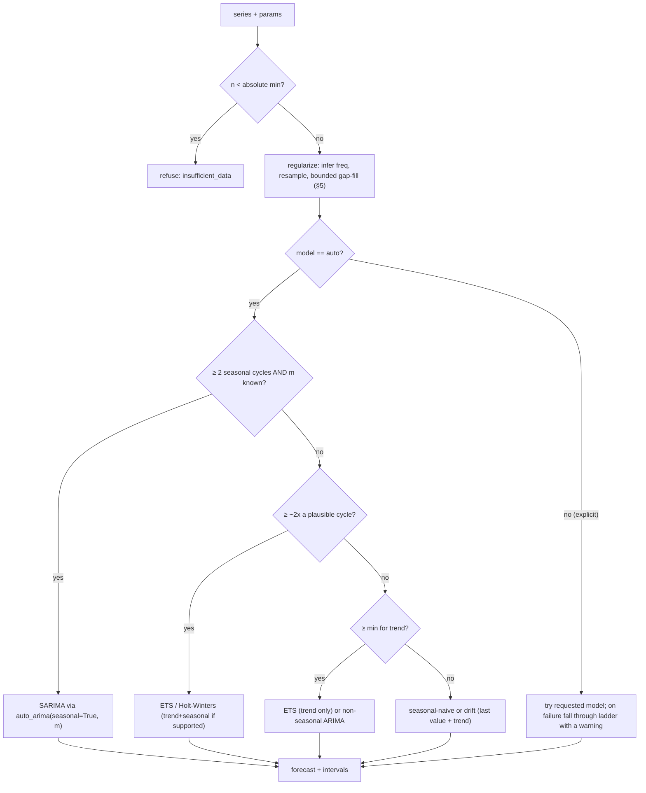

# Forecast Platform — Build Guide 3: The Forecasting / ML Service

> **What this document is.** The authoritative specification for the `ml` service — the stateless forecasting core that is the product's actual value proposition. Documents 1 and 2 treat `ml` as a black box behind a two-endpoint contract (`/forecast`, `/eda`); this document is what's inside the box. It exists because the earlier drafts repeatedly deferred to "the SARIMA logic already built during coursework," which is an external reference, not a spec — so the core of the product was effectively a stub. This closes that gap.
>
> Consistent with `forecast-platform-project-guide.md` ("the guide") and the two build docs ("doc 1", "doc 2"). Depends on the schema addenda in doc 1 §12 (notably `metrics.seasonal_period` and `metrics.key`).

---

## 0. Design stance

Three principles shape every decision below:

1. **`ml` is a pure function.** Series in, forecast out. No database, no auth, no state, no knowledge of tenants or connectors. This is what makes it independently testable (golden files), independently scalable (doc 2 §6), and safe to call from `worker` without ceremony. Nothing in this document may violate it.
2. **Robustness over sophistication.** The product's users are not statisticians (guide's market thesis). A forecast that is *always produced and never absurd* beats a theoretically optimal one that errors on short or messy series. The whole design biases toward graceful degradation.
3. **Reuse the mature library, not the coursework code.** The from-scratch SARIMA/Durbin-Levinson work referenced in the guide was pedagogical. Production uses `statsmodels` + `pmdarima`, which are battle-tested, handle edge cases the coursework code doesn't, and are exactly what the guide's own library table specifies. The coursework remains valuable as *validation* — a golden-file test can assert the library agrees with the hand-derived result on the known UKDriverDeaths-style series — but it is not what runs in production.

---

## 1. Requirements

### Functional
- Given a time series and a horizon, return a point forecast plus lower/upper confidence bounds per future step.
- Support automatic model selection (`auto`) and explicit model choice (`sarima` | `ets` | `prophet`).
- Support automatic ARIMA order selection (via `pmdarima`) and manual order override.
- Determine or accept a seasonal period `m`.
- Produce an EDA report: stationarity, seasonality, ACF/PACF.
- Degrade gracefully on short, irregular, or gappy series rather than erroring.

### Non-functional
- **Deterministic** for a fixed input + params (required for golden-file testing; see §7). Seed anything stochastic.
- **Fast enough:** a single `auto_arima` fit on a few thousand points completes in low seconds on one CPU core (guide's cost thesis depends on this). Bound the search so it can't run away.
- **Stateless & horizontally scalable** — no shared state between requests.
- **Self-describing failures:** never raise an opaque 500 into `worker`; return a structured result with a `warning` or a clean error the UI can show.

---

## 2. The API contract (authoritative)

### `POST /forecast`

```jsonc
// request
{
  "series": [                      // ascending by timestamp; may have gaps
    {"timestamp": "2026-06-01T00:00:00Z", "value": 42.0}, ...
  ],
  "horizon": 24,                   // steps ahead, in the series' own frequency
  "model": "auto",                 // "auto" | "sarima" | "ets" | "prophet"
  "seasonal_period": 24,           // m; null → auto-detect / non-seasonal (from metrics.seasonal_period)
  "model_params": {},              // manual override, e.g. {"order":[2,1,2],"seasonal_order":[1,1,1,24]}
  "confidence": 0.95               // interval width; default 0.95
}
```

```jsonc
// response — success
{
  "model": "sarima",              // the model ACTUALLY used (may differ from request on fallback)
  "model_params": {"order": [1,1,1], "seasonal_order": [0,1,1,24], "m": 24},
  "frequency": "H",               // the frequency ml inferred/used (pandas offset alias)
  "points": [
    {"timestamp": "2026-07-01T00:00:00Z", "predicted": 43.1, "lower": 40.2, "upper": 46.0}, ...
  ],
  "metrics": {"aic": 1234.5, "in_sample_mape": 0.081},   // fit diagnostics, for UI/model-comparison
  "warning": "series shorter than 2 seasonal cycles; used ETS instead of SARIMA"  // or null
}
```

```jsonc
// response — refusal (too little/too broken to forecast at all)
{
  "error": "insufficient_data",
  "detail": "need at least 8 points, received 3",
  "min_required": 8
}
```

The `worker` maps a success into `forecast_runs`/`forecast_points` (writing `model_params` back so the run is reproducible), a `warning` into a non-fatal note surfaced in the UI, and an `error` into `forecast_runs.status='failed'` with the detail as `error_message`.

### `POST /eda`

```jsonc
// request
{ "series": [ {"timestamp":"...","value":...}, ... ], "seasonal_period": 24 }
// response
{
  "frequency": "H",
  "n_points": 2160,
  "stationarity": {"adf_stat": -3.4, "p_value": 0.011, "is_stationary": true,
                   "plain": "This series looks stationary — its statistical behavior is stable over time."},
  "seasonality": {"detected_period": 24, "strength": 0.62,
                  "plain": "Strong daily pattern detected (repeats every 24 points)."},
  "acf_pacf": {"acf": [1.0, 0.8, ...], "pacf": [1.0, 0.5, ...], "lags": [0,1,...]}
}
```

The `plain` fields are deliberate: the EDA report is a *product feature for non-experts* (guide §9), not a stats dump. Every numeric result carries a one-sentence human reading.

---

## 3. The model-selection ladder

This is the heart of "robustness over sophistication." Given a request, `ml` walks down until it finds a model the data can support. The ladder is what guarantees a forecast is *always* returned for any series that clears the absolute minimum (§4).



- **`auto` is the default and the recommended path.** It picks the richest model the series can support and records what it chose in `model_params`, so the user never has to understand ARIMA orders.
- **Explicit model requests are honored but not blindly.** If a user forces `sarima` on a 10-point series, `ml` attempts it, and on failure falls through the ladder returning the best it *could* do plus a `warning` explaining the substitution — never a hard error. The forecast the user sees is always real.
- **Seasonal-naive/drift is the floor, not a failure.** For very short series it's genuinely the honest forecast, and it's what makes the cold-start problem (guide) survivable: a brand-new connector with two weeks of daily data still gets a sensible, clearly-caveated forecast instead of an error page.

---

## 4. Minimum series length — concrete thresholds

| Situation | Minimum points | Model used |
|---|---|---|
| Absolute floor to return anything | `max(4, 2)` → **4** | seasonal-naive / drift |
| Non-seasonal trend model (ETS/ARIMA) | **~10** | ETS(trend) or ARIMA(p,d,q) |
| Seasonal model (SARIMA/Holt-Winters) | **`2 * m + 1`**, realistically **2 full cycles** (`2m`) | SARIMA / Holt-Winters |
| Comfortable seasonal fit | **≥ 3–4 cycles** | SARIMA with reliable seasonal terms |

`2 * m + 1` is the hard mathematical floor for estimating a seasonal model (you need at least two observations of each seasonal position plus one); below `2m` the seasonal terms are unreliable, so the ladder drops to a non-seasonal model with a warning rather than fitting garbage. For hourly data with `m=24`, that's 49 points absolute / ~48 for two cycles — i.e. about two days of history before daily seasonality is trustworthy. The `ml` service encodes these as constants so the thresholds are testable and tunable in one place.

---

## 5. Handling irregular, gappy, and missing data

Real polled data is messier than coursework data. `ml` regularizes before modeling:

1. **Infer frequency.** From the median spacing of timestamps, snap to the nearest pandas offset (`H`, `D`, `W`, ...). Report it back as `frequency` so the UI and `worker` agree on what a "step" means.
2. **Resample onto a regular grid** at that frequency. Duplicate timestamps (shouldn't happen given the `(metric_id, timestamp)` upsert, but defend anyway) are aggregated by mean.
3. **Fill gaps, but bounded.** Interpolate/forward-fill runs of missing points *up to a cap* (e.g. ≤ 3 consecutive, or ≤ 5% of the series). Beyond the cap the gap is left as missing and the model handles it (statsmodels tolerates NaNs for some models) or the series is flagged. Unbounded fill is forbidden — inventing a week of data produces confident nonsense.
4. **Flag over-sparse series.** If after regularization more than a threshold fraction is imputed, attach a `warning` that the forecast rests heavily on interpolation.

This regularization lives entirely in `ml` (it's forecasting-domain logic on a pure input), which keeps `worker` dumb — `worker` ships whatever points exist and lets `ml` decide what's forecastable.

---

## 6. Reference implementation sketch

Enough to write against; not the whole file. Structure the service so the ladder and the thresholds are the only places policy lives.

```python
# services/ml/forecasting.py
from dataclasses import dataclass

ABS_MIN = 4
TREND_MIN = 10
def seasonal_min(m: int) -> int: return 2 * m           # two full cycles

@dataclass
class ForecastResult:
    model: str
    model_params: dict
    frequency: str
    points: list        # [{timestamp, predicted, lower, upper}]
    metrics: dict
    warning: str | None = None

def forecast(series, horizon, model="auto", seasonal_period=None,
             model_params=None, confidence=0.95) -> ForecastResult:
    if len(series) < ABS_MIN:
        raise InsufficientData(min_required=ABS_MIN, received=len(series))

    s, freq, impute_frac = regularize(series)          # §5: infer freq, resample, bounded fill
    m = seasonal_period or autodetect_period(s)        # None-safe; may return None

    if model != "auto":
        return _try_explicit(model, s, horizon, m, model_params, confidence, freq, impute_frac)

    # auto: descend the ladder (§3)
    if m and len(s) >= seasonal_min(m):
        return _sarima(s, horizon, m, confidence, freq, warn=_impute_warn(impute_frac))
    if m and len(s) >= 2 * _plausible_cycle(s):
        return _holt_winters(s, horizon, m, confidence, freq,
                             warn="fewer than 2 full seasonal cycles; seasonality is approximate")
    if len(s) >= TREND_MIN:
        return _ets_trend(s, horizon, confidence, freq,
                         warn="not enough data for a seasonal model; used trend-only")
    return _seasonal_naive(s, horizon, m, confidence, freq,
                          warn="very short series; used a naive forecast")

def _sarima(s, horizon, m, confidence, freq, warn=None):
    import pmdarima as pm
    model = pm.auto_arima(s, seasonal=True, m=m,
                          max_order=None, stepwise=True,      # stepwise bounds the search (§ non-functional)
                          suppress_warnings=True, error_action="ignore")
    pred, ci = model.predict(horizon, return_conf_int=True, alpha=1 - confidence)
    return ForecastResult(
        model="sarima",
        model_params={"order": list(model.order),
                      "seasonal_order": list(model.seasonal_order), "m": m},
        frequency=freq,
        points=_assemble(s, freq, horizon, pred, ci),
        metrics={"aic": float(model.aic()), "in_sample_mape": _mape(model, s)},
        warning=warn,
    )
```

Key points a reviewer should hold the implementation to:
- **All policy (thresholds, ladder order) is in `forecast()`;** the `_sarima`/`_ets`/`_naive` helpers are dumb executors. Tuning the product's behavior is editing constants and the ladder, nowhere else.
- **`auto_arima` uses `stepwise=True`** so the order search is bounded — a naive full grid can blow the latency budget on long series.
- **Confidence intervals come from the model**, not a fixed multiplier, so they honestly widen with horizon and uncertainty.
- **Determinism:** `pmdarima`/`statsmodels` fits are deterministic given the data; if `prophet` (which samples) is added, set its seed and sampling to fixed values, or golden-file tests break.

---

## 7. Testing the ml service

Because `ml` is a pure function, testing is unusually clean — this is a payoff of the statelessness principle, not an afterthought.

- **Golden-file forecasts.** Commit input series + expected forecast output (within a tolerance) as fixtures. A known series (e.g. a synthetic hourly signal with injected daily seasonality, or the UKDriverDeaths-style set from the coursework) with a pinned model produces a stable forecast; the test asserts the service still reproduces it. This is the regression net that lets you upgrade `statsmodels`/`pmdarima` without silently changing forecasts. Tolerance handles floating-point/library micro-differences; a large deviation means a real behavioral change to investigate.
- **Ladder-coverage tests.** One test per rung: feed a series engineered to land on exactly that rung (3 points → refuse; 8 points → trend-only; 30 points with m=24 → Holt-Winters with the "fewer than 2 cycles" warning; 100 points with m=24 → SARIMA) and assert both the chosen `model` and the `warning`.
- **Regularization tests.** Gappy input → assert bounded fill (a 2-gap is filled, a 20-gap is left/flagged); irregular spacing → assert correct `frequency` inference.
- **Coursework cross-check (optional but valuable).** A single test asserting `pmdarima` agrees (within tolerance) with the hand-derived coursework result on its original dataset — turning the referenced-but-absent coursework code into a *validation oracle* rather than production code.
- **Contract tests.** Malformed requests (empty series, horizon 0, unknown model) return structured errors, never 500s.

Run these with plain pytest against the in-process functions — no container, no DB, because `ml` needs neither. That speed is why the ladder can have thorough per-rung coverage cheaply.

---

## 7b. Resource guards — why the service cannot be worked to death

Added 2026-07-06 after a production incident: as a metric's history grew, single `auto_arima` fits crossed minutes and gigabytes; the worker's timeout+retry then stacked duplicate fits on the request threadpool (uvicorn keeps computing abandoned requests) until the process ran out of memory. The measured baseline on the incident series: **347s / ~2 GB per fit**, requested every 15 minutes with up to 5 retry duplicates.

Per-fit work is now **bounded by construction**, plus the app sheds load:

1. **Training window** (`MAX_FIT_POINTS = 512`): fitting uses the most recent 512 regularized grid points, so per-fit cost is independent of how long the metric has existed. The window used is reported as `metrics.train_points`. EDA obeys the same cap (robust STL is the same hazard).
2. **SARIMA seasonal ceiling** (`SARIMA_MAX_M = 24`): SARIMA cost grows with the state-space dimension (~m), so large periods (weekly=168) go straight to the Holt-Winters rung, which handles long seasonality in O(n). An explicit `model="sarima"` request with a larger m substitutes down the ladder with a warning, per the §3 substitution contract.
3. **Constrained stepwise search** (`max_p/q=3`, seasonal `P/Q≤1`, `maxiter=30`): the incident-series fit drops 347s → ~24s. Golden fixtures were unaffected (identical models chosen).
4. **Fit-slot semaphore** (`MAX_CONCURRENT_FITS = 2`, 5s wait): a saturated service answers **503 + Retry-After** instead of queueing unbounded work. The worker already treats 5xx as a transport failure with exponential backoff, so load is shed, not stacked.
5. **Worker side**: the series payload is capped (`forecast_max_series_points = 5000`, newest points) and the ml client timeout is 120s so a normal bounded fit is never abandoned mid-flight only to be re-requested.

The regression suite is `services/ml/tests/test_resource_guards.py`. If a heavier tier ever needs longer windows or bigger searches, raise the constants together with the concurrency/timeout budget — never one without the other; the incident was exactly that mismatch.

## 8. Trade-offs & what to revisit

- **`pmdarima` auto_arima over hand-rolled selection:** mature and robust, at the cost of a heavier dependency and less control over the exact search. Accepted — control isn't worth reimplementing edge-case handling. Revisit only if the dependency becomes unmaintained (watch this; it has had maintenance lulls) — `statsmodels` alone plus a small custom search is the fallback.
- **Classical models only (SARIMA/ETS/Prophet), no deep learning:** correct for the workload and cost thesis (guide). Deep models (N-BEATS, TFT) are explicitly a later, opt-in "premium accuracy" tier and a reason for the GPU workstation — not the MVP. The ladder has a clean place to add them as a top rung later.
- **Bounded gap-fill threshold is a guess:** the ≤3-consecutive / ≤5% caps are reasonable defaults, not law. They're constants for a reason; tune against real polled data once it exists.
- **Per-request fitting, no model caching:** simplest and stateless, but refits from scratch each forecast. Fine at MVP volume. If forecast latency or cost rises, caching fitted models keyed by `(metric_id, data_hash)` is the optimization — but it introduces state, so it lives behind a cache interface, not inside the pure function.

## 9. What this unblocks
With this spec, the `ml` service is no longer a stub: the endpoints, the model-selection behavior, the exact minimum-data thresholds, the messy-data handling, and the test strategy are all pinned. A coding assistant can implement `services/ml/` directly from §2–§7, and `worker` can be written against §2's contract with no remaining ambiguity about what comes back.
