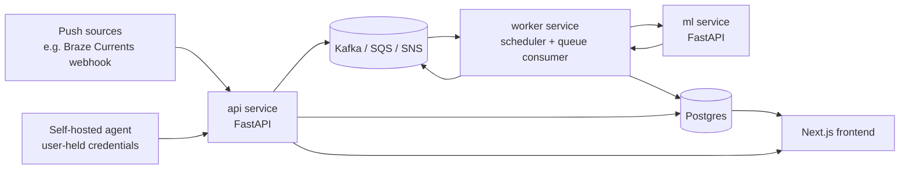
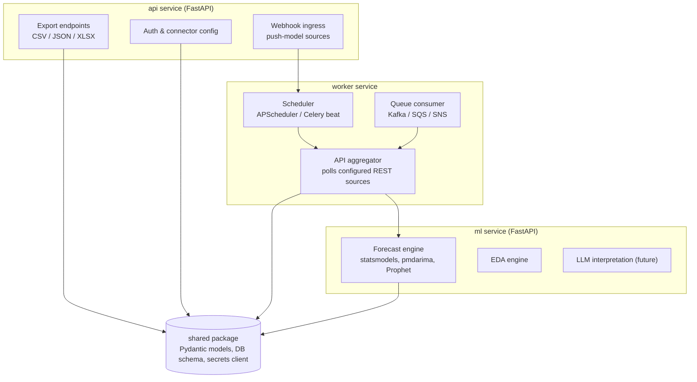
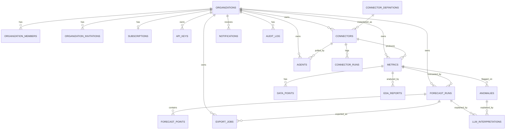
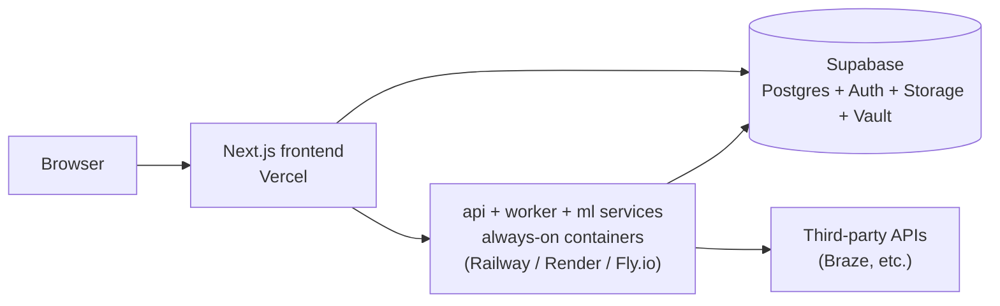

# Forecast Platform — Project Guide & Build Specification

> **Purpose of this document.** This is a self-contained build specification consolidating a product discovery conversation into something an AI coding assistant (e.g. Claude via Claude Code) can use as project context to start implementation. If you are an AI assistant reading this to bootstrap work: start with **Section 8 (POC Requirement Sheet)** for scope, then follow **`05-implementation-plan.md`** for the dependency-ordered build sequence and the last-mile specs (provider interfaces, config surface, `ml` helper algorithms, demo data source) — it's the actionable entry point. Sections 1–7 give you the "why" behind the decisions so you don't re-litigate them. Sections 9–11 tell you where this is headed so you don't paint the codebase into a corner. **Deployment (Section 10) is intentionally sequenced after the MVP — do not start on it until the app is fully functional locally.**

**Owner:** Alexandru
**Stack of choice:** Python monorepo (FastAPI services) for the backend, Next.js for the frontend, Postgres (Supabase) for storage
**Starting point:** local, open-source-style, single-machine app (Docker Compose)
**End state:** distributed, event-driven, multi-tenant SaaS with an optional open-source self-hosted edition

---

## 1. Context and origin

The project started from a simple observation: the person's employer uses **Braze** for customer engagement, and Braze's own analytics can't do meaningful forecasting on business metrics. This evolved through several pivots into its current shape:

1. **Original idea** — upload a CSV, get an automated EDA report + forecast (SARIMA, exponential smoothing, Prophet-style models). A one-shot analysis tool.
2. **Pivot to recurring data collection** — instead of requiring the user to already have a clean dataset, the app itself **polls configured APIs on a schedule** (hourly/daily/monthly) and builds its own historical time series over time. This is a stickier product: value compounds the longer someone uses it, because forecast quality improves with accumulated history.
3. **Market validation** — this is a real, validated category. **Anodot** does almost exactly this (autonomous business monitoring: ingests from REST APIs, Kafka, SaaS platforms, S3, SQL; provides forecasting and anomaly detection) but is enterprise-only, sales-led, "contact us" pricing. Observability tools (Datadog, Grafana, SigNoz) treat forecasting as a bolt-on to infra monitoring, not the core product. Enterprise AutoML (DataRobot) starts at $100K+/year. Notably, **Amazon Forecast** — AWS's own standalone forecasting product — closed to new customers in July 2024 and was folded into the broader SageMaker Canvas platform, a signal that forecasting alone may not be a strong enough standalone hook without complementary features (monitoring, alerting, interpretation).
4. **Identified gap** — nobody serves the self-serve, low-cost, "plug in any REST API and get a forecast" niche between "enterprise tool with a sales call" and "no tool at all."
5. **Secrets handling problem** — the "poll arbitrary APIs on the user's behalf" model means storing third-party API credentials, which is a real security/liability burden. Two mitigations were chosen (see Section 7):
   - **Push model**: where the source platform supports outbound webhooks (e.g. Braze Currents' Custom HTTP Connector), the app never needs to store the source credential at all.
   - **Self-hosted agent model**: for pull-only sources, ship an open-source agent the user runs on their own infrastructure; it holds the credential locally and only ever transmits normalized numeric data points to the core service.

### 1.1 Language decision — Python monorepo over Java + Python split

The project originally planned a Java/Spring Boot core service alongside a Python ML service, on the reasoning that Spring Boot's scheduling, messaging (SNS/SQS/Kafka), and web-layer tooling were meaningfully stronger than Python's. That reasoning was revisited and **reversed**:

- Python has mature, production-grade equivalents for every piece Spring Boot was chosen for: `APScheduler`/Celery beat for scheduling, `aiokafka`/`confluent-kafka-python` for Kafka, `boto3`/`aioboto3` for SQS/SNS, Celery for distributed task queues, SQLAlchemy + Alembic for persistence. The polling workload itself is I/O-bound, which suits Python's `asyncio` well.
- Running two languages means maintaining an API contract between your *own* services, which is a real, ongoing tax for a solo-maintained, pre-revenue project. That tax isn't earning its keep yet.
- **Decision:** consolidate into a **single-language Python monorepo**, split into multiple services (not one monolith) so the separation of concerns from the original design is preserved without the cross-language overhead. If a concrete reason to reintroduce a second language appears later (a real scaling bottleneck, a real team boundary, or a deliberate desire to practice Java/Spring Boot professionally), the service boundaries in this design make that a clean lift rather than a rewrite.

---

## 2. Product concept

A platform that:

- Lets a user configure metrics they want to monitor, sourced from arbitrary APIs (starting with Braze, generalizing to "any REST API + JSONPath").
- Collects data continuously (poll or push), building its own historical time series independent of the source platform's retention policy.
- Forecasts those metrics using classical statistical models (SARIMA, ETS, Prophet-style), with room to grow into anomaly detection and, eventually, LLM-driven narrative interpretation.
- Lets users **export** their forecasts in common formats for use outside the platform.
- Ships as **both** an open-source, self-hostable project **and** a subscription SaaS for teams who don't want to run their own infrastructure.

### Two ingestion models (see Section 7 for full detail)

| Model | How it works | Credential custody |
|---|---|---|
| **Push** | Source platform sends data to a webhook URL the app provides (e.g. Braze Currents Custom HTTP Connector) | App never touches the source credential |
| **Agent (pull)** | User runs a small open-source Docker agent on their own infra; it polls the source and forwards only data points | Credential never leaves the user's infrastructure |
| **Server-side pull (fallback)** | Core service polls directly using a stored, encrypted credential | App stores the credential — last resort, used only when push/agent aren't viable |

---

## 3. High-level system architecture (logical view)

This is the logical architecture — service responsibilities and data flow, independent of where each piece is hosted. Hosting specifics are mapped out separately in Section 10.



**Division of responsibility:**

- **`api` service** — connector configuration, auth, webhook ingress (push model), export endpoints, everything the frontend talks to directly.
- **`worker` service** — cron-based scheduling, polling execution, and the event listener (Kafka/SQS/SNS consumer). This is where the "run constantly" requirement lives operationally — see Section 10.
- **`ml` service** — purely the forecasting/ML computation: SARIMA/ETS/Prophet model fitting, EDA statistics, and (later) anomaly detection and LLM-based interpretation. Stateless, horizontally scalable, called by the `worker` service. Notably, only `api` and `worker` read/write the database directly — `ml` stays fully stateless and communicates purely via its REST contract. That's the real mechanism keeping the three services loosely coupled even though they share one Postgres instance (see Section 5).

This split still exists (even within one language) because it lets each piece scale and deploy independently — `worker` needs to be a persistent long-running process, `api` is request/response, and `ml` is CPU-bound and trivially parallel across metrics.

---

## 4. Python monorepo — service breakdown



### 4.1 Suggested repository layout

```
/forecast-platform
  /services
    /api          — FastAPI: auth, connector config, webhook ingress, export endpoints
    /worker        — scheduler, polling jobs, queue consumers
    /ml            — FastAPI: forecasting, EDA, (future) anomaly detection & LLM interpretation
  /shared
    /models        — Pydantic models shared across services
    /db            — SQLAlchemy models + Alembic migrations (schema defined in Section 5)
    /secrets       — SecretsProvider abstraction (Section 7)
  /agent            — open-source self-hosted polling agent (Section 7.7)
  /frontend         — Next.js app (TypeScript; lives in the same repo, deployed separately to Vercel)
  docker-compose.yml
```

Note: "monorepo" here refers to repository structure, not language purity — the Next.js frontend is TypeScript and lives alongside the Python services in the same repo, which is the normal shape for this kind of project.

### 4.2 Key library choices

| Concern | Library | Notes |
|---|---|---|
| Web framework (`api`, `ml`) | FastAPI | Async-native, strong typing via Pydantic |
| Scheduling | `APScheduler` then Celery beat later | `APScheduler` is enough while cadences are simple; move to Celery beat once schedules are dynamic and per-tenant |
| Distributed task queue | Celery (broker: Redis / RabbitMQ / SQS) | Backbone for the `worker` service's job execution |
| Kafka | `aiokafka` or `confluent-kafka-python` | Either is production-grade |
| AWS SQS/SNS | `boto3` / `aioboto3` | Standard, well-documented |
| ORM + migrations | SQLAlchemy + Alembic | |
| Validation/typing | Pydantic + type hints + mypy | |
| JSONPath extraction (generic connector) | `jsonpath-ng` | Maps arbitrary API responses to metric values |
| Forecasting | `statsmodels`, `pmdarima`, `prophet` | Reuses the SARIMA/Durbin-Levinson work already done in coursework |
| Export | `pandas` (CSV/JSON), `openpyxl` (XLSX) | See Section 6 |
| Frontend | Next.js (TypeScript) | Deployed to Vercel — see Section 10 |

---

## 5. Database schema

Design principles: tenant isolation is structural (via Postgres Row-Level Security, not just app-layer checks); connector types are data, not schema, so new sources are added by inserting a catalog row, never a migration; raw data, computed results, and configuration are kept in clearly separate tables; secrets are structurally absent from this database — only an opaque pointer is ever stored; and the time-series table is designed for its actual scale profile, which is wildly different from every other table here.

### 5.1 Entity relationships



### 5.2 DDL

```sql
-- Extensions
CREATE EXTENSION IF NOT EXISTS pgcrypto; -- gen_random_uuid()

-- ── Identity / tenancy ──────────────────────────────────────────────

CREATE TABLE organizations (
    id          UUID PRIMARY KEY DEFAULT gen_random_uuid(),
    name        TEXT NOT NULL,
    plan_tier   TEXT NOT NULL DEFAULT 'free' CHECK (plan_tier IN ('free','pro','enterprise')),
    created_at  TIMESTAMPTZ NOT NULL DEFAULT now()
);

-- Many-to-many: a user can belong to more than one org/workspace
CREATE TABLE organization_members (
    organization_id UUID NOT NULL REFERENCES organizations(id) ON DELETE CASCADE,
    user_id         UUID NOT NULL REFERENCES auth.users(id) ON DELETE CASCADE,
    role            TEXT NOT NULL DEFAULT 'member' CHECK (role IN ('owner','admin','member')),
    joined_at       TIMESTAMPTZ NOT NULL DEFAULT now(),
    PRIMARY KEY (organization_id, user_id)
);

-- ── Connector catalog (platform-level, NOT tenant-scoped) ──────────
-- New source types are added by inserting a row here, never a migration.

CREATE TABLE connector_definitions (
    id               UUID PRIMARY KEY DEFAULT gen_random_uuid(),
    key              TEXT NOT NULL UNIQUE,      -- 'generic_rest', 'braze', ...
    name             TEXT NOT NULL,
    description      TEXT,
    config_schema    JSONB NOT NULL,            -- drives the frontend setup wizard's form fields
    supports_push    BOOLEAN NOT NULL DEFAULT false,
    supports_pull    BOOLEAN NOT NULL DEFAULT true,
    supports_agent   BOOLEAN NOT NULL DEFAULT true,
    created_at       TIMESTAMPTZ NOT NULL DEFAULT now()
);

-- ── Tenant configuration ────────────────────────────────────────────

CREATE TABLE connectors (
    id                       UUID PRIMARY KEY DEFAULT gen_random_uuid(),
    organization_id          UUID NOT NULL REFERENCES organizations(id) ON DELETE CASCADE,
    connector_definition_id  UUID NOT NULL REFERENCES connector_definitions(id),
    name                     TEXT NOT NULL,
    config                   JSONB NOT NULL DEFAULT '{}',  -- non-sensitive only: base_url, etc.
    secret_ref               TEXT,                          -- pointer into SecretsProvider; never the secret itself
    ingestion_method         TEXT NOT NULL CHECK (ingestion_method IN ('push','pull','agent')),
    schedule_cron            TEXT,                           -- only used when ingestion_method = 'pull'
    webhook_token            TEXT UNIQUE,                    -- only used when ingestion_method = 'push'
    status                   TEXT NOT NULL DEFAULT 'active' CHECK (status IN ('active','paused','error')),
    created_at               TIMESTAMPTZ NOT NULL DEFAULT now(),
    updated_at               TIMESTAMPTZ NOT NULL DEFAULT now()
);

CREATE TABLE metrics (
    id                 UUID PRIMARY KEY DEFAULT gen_random_uuid(),
    organization_id    UUID NOT NULL REFERENCES organizations(id) ON DELETE CASCADE,  -- denormalized for RLS
    connector_id       UUID NOT NULL REFERENCES connectors(id) ON DELETE CASCADE,
    name               TEXT NOT NULL,
    unit               TEXT,
    extraction_config  JSONB NOT NULL DEFAULT '{}',   -- endpoint override, JSONPath, response shape
    created_at         TIMESTAMPTZ NOT NULL DEFAULT now(),
    updated_at         TIMESTAMPTZ NOT NULL DEFAULT now()
);

-- ── Raw time series — the highest-volume table by far, partitioned ──

CREATE TABLE data_points (
    metric_id        UUID NOT NULL REFERENCES metrics(id) ON DELETE CASCADE,
    organization_id  UUID NOT NULL,   -- denormalized for RLS; validated at write time by the api/worker layer
    "timestamp"      TIMESTAMPTZ NOT NULL,
    value            DOUBLE PRECISION NOT NULL,
    source           TEXT NOT NULL DEFAULT 'poll' CHECK (source IN ('poll','webhook','agent','backfill')),
    ingested_at      TIMESTAMPTZ NOT NULL DEFAULT now(),
    PRIMARY KEY (metric_id, "timestamp")
) PARTITION BY RANGE ("timestamp");

-- One partition per month, created ahead of time (see pg_partman note in 5.3)
CREATE TABLE data_points_2026_07 PARTITION OF data_points
    FOR VALUES FROM ('2026-07-01') TO ('2026-08-01');

-- ── Computed output ─────────────────────────────────────────────────

CREATE TABLE forecast_runs (
    id              UUID PRIMARY KEY DEFAULT gen_random_uuid(),
    organization_id UUID NOT NULL REFERENCES organizations(id) ON DELETE CASCADE,
    metric_id       UUID NOT NULL REFERENCES metrics(id) ON DELETE CASCADE,
    model_type      TEXT NOT NULL CHECK (model_type IN ('sarima','ets','prophet')),
    model_params    JSONB NOT NULL DEFAULT '{}',
    horizon         INTEGER NOT NULL,
    status          TEXT NOT NULL DEFAULT 'pending' CHECK (status IN ('pending','running','completed','failed')),
    requested_at    TIMESTAMPTZ NOT NULL DEFAULT now(),
    completed_at    TIMESTAMPTZ,
    error_message   TEXT
);

CREATE TABLE forecast_points (
    forecast_run_id  UUID NOT NULL REFERENCES forecast_runs(id) ON DELETE CASCADE,
    "timestamp"      TIMESTAMPTZ NOT NULL,
    predicted_value  DOUBLE PRECISION NOT NULL,
    lower_bound      DOUBLE PRECISION,
    upper_bound      DOUBLE PRECISION,
    PRIMARY KEY (forecast_run_id, "timestamp")
);

CREATE TABLE eda_reports (
    id              UUID PRIMARY KEY DEFAULT gen_random_uuid(),
    organization_id UUID NOT NULL REFERENCES organizations(id) ON DELETE CASCADE,
    metric_id       UUID NOT NULL REFERENCES metrics(id) ON DELETE CASCADE,
    generated_at    TIMESTAMPTZ NOT NULL DEFAULT now(),
    stationarity    JSONB,
    seasonality     JSONB,
    acf_pacf        JSONB
);

-- ── Export & agents ──────────────────────────────────────────────────

CREATE TABLE export_jobs (
    id               UUID PRIMARY KEY DEFAULT gen_random_uuid(),
    organization_id  UUID NOT NULL REFERENCES organizations(id) ON DELETE CASCADE,
    requested_by     UUID NOT NULL REFERENCES auth.users(id),
    forecast_run_id  UUID NOT NULL REFERENCES forecast_runs(id) ON DELETE CASCADE,
    format           TEXT NOT NULL CHECK (format IN ('csv','json','xlsx')),
    status           TEXT NOT NULL DEFAULT 'pending' CHECK (status IN ('pending','processing','completed','failed')),
    file_path        TEXT,          -- Supabase Storage object path
    share_token      TEXT UNIQUE,   -- powers the shareable expiring link
    expires_at       TIMESTAMPTZ,
    created_at       TIMESTAMPTZ NOT NULL DEFAULT now()
);

CREATE TABLE agents (
    id                    UUID PRIMARY KEY DEFAULT gen_random_uuid(),
    organization_id       UUID NOT NULL REFERENCES organizations(id) ON DELETE CASCADE,
    connector_id          UUID REFERENCES connectors(id) ON DELETE SET NULL,
    ingestion_token_hash  TEXT NOT NULL,   -- store a hash, never the raw token
    last_heartbeat_at     TIMESTAMPTZ,
    status                TEXT NOT NULL DEFAULT 'active' CHECK (status IN ('active','stale','revoked')),
    created_at            TIMESTAMPTZ NOT NULL DEFAULT now(),
    revoked_at            TIMESTAMPTZ
);

-- ── Indexes ───────────────────────────────────────────────────────────
CREATE INDEX idx_connectors_org       ON connectors(organization_id);
CREATE INDEX idx_metrics_org          ON metrics(organization_id);
CREATE INDEX idx_metrics_connector    ON metrics(connector_id);
CREATE INDEX idx_forecast_runs_metric ON forecast_runs(metric_id);
CREATE INDEX idx_export_jobs_org      ON export_jobs(organization_id);
```

Deliberate choices worth flagging:

- **No surrogate `id` on `data_points` or `forecast_points`.** The composite primary key `(metric_id, timestamp)` is the natural key. This makes ingestion idempotent for free — a retried poll or re-delivered webhook becomes a trivial `INSERT ... ON CONFLICT (metric_id, timestamp) DO UPDATE`, so duplicate delivery can never corrupt the series.
- **`value` is `DOUBLE PRECISION`, not `NUMERIC`.** Standard trade-off for a forecasting/analytics product: float storage is far more compact and faster at this row count, and forecasting math is approximate by nature. A specific metric needing exact precision (e.g. billing figures) is a case for `NUMERIC` on that one metric type, not a reason to make the whole table heavier.

### 5.3 Partitioning strategy — and a stack-specific correction

`data_points` will dwarf every other table combined — a modest install (hundreds of metrics polled hourly) produces millions of rows a year.

1. **Partition by time, monthly**, using native Postgres declarative partitioning (as in the DDL above). Queries scoped to a recent time range only touch one or two partitions; old partitions can be dropped or archived wholesale instead of running a slow `DELETE`.
2. **For automated partition creation**: Supabase previously offered **TimescaleDB** for this kind of workload, but it was **deprecated and removed** as part of Supabase's Postgres 17 upgrade. In its place, Supabase now supports **`pg_partman`**, which automates creating future partitions and dropping old ones on a schedule (paired with `pg_cron` to run its maintenance function periodically). This is worth knowing explicitly since TimescaleDB would have been the natural first instinct — it's no longer the right answer on this specific platform. Use native partitioning + `pg_partman`.

### 5.4 Row-Level Security — the actual multi-tenancy enforcement

Every tenant-owned table gets a policy of this shape:

```sql
ALTER TABLE connectors ENABLE ROW LEVEL SECURITY;

CREATE POLICY "org members access their own connectors"
    ON connectors
    USING (
        organization_id IN (
            SELECT organization_id FROM organization_members
            WHERE user_id = auth.uid()
        )
    );
```

Repeat for `metrics`, `forecast_runs`, `eda_reports`, `export_jobs`, `agents`, `data_points`, `organization_invitations`, `subscriptions`, `api_keys`, `connector_runs`, `notifications`, `audit_log`, `anomalies`, and `llm_interpretations`. This is why `organization_id` is denormalized onto `metrics`, `data_points`, and `connector_runs` even though it's technically derivable by joining through `connectors` — an RLS policy that joins three tables on every row of the largest tables is a real performance problem at scale; a flat, indexed `organization_id` keeps that check cheap regardless of table size. `forecast_points` and `outbox_events` are left without an `organization_id`/RLS policy: `forecast_points` can join through the much smaller `forecast_runs` table without meaningful cost, and `outbox_events` is an internal relay mechanism the application layer reads, never exposed directly to tenant-facing queries.

### 5.5 Team, billing, and operational tables

```sql
-- ── Team & billing ──────────────────────────────────────────────────

CREATE TABLE organization_invitations (
    id               UUID PRIMARY KEY DEFAULT gen_random_uuid(),
    organization_id  UUID NOT NULL REFERENCES organizations(id) ON DELETE CASCADE,
    email            TEXT NOT NULL,
    role             TEXT NOT NULL DEFAULT 'member' CHECK (role IN ('owner','admin','member')),
    invited_by       UUID NOT NULL REFERENCES auth.users(id),
    token            TEXT NOT NULL UNIQUE,
    status           TEXT NOT NULL DEFAULT 'pending' CHECK (status IN ('pending','accepted','revoked','expired')),
    expires_at       TIMESTAMPTZ NOT NULL,
    created_at       TIMESTAMPTZ NOT NULL DEFAULT now()
);

CREATE TABLE subscriptions (
    id                        UUID PRIMARY KEY DEFAULT gen_random_uuid(),
    organization_id           UUID NOT NULL UNIQUE REFERENCES organizations(id) ON DELETE CASCADE,
    provider                  TEXT NOT NULL DEFAULT 'stripe',
    provider_customer_id      TEXT,
    provider_subscription_id  TEXT,
    plan_tier                 TEXT NOT NULL DEFAULT 'free' CHECK (plan_tier IN ('free','pro','enterprise')),
    status                    TEXT NOT NULL DEFAULT 'active' CHECK (status IN ('active','past_due','canceled','trialing')),
    current_period_end        TIMESTAMPTZ,
    created_at                TIMESTAMPTZ NOT NULL DEFAULT now(),
    updated_at                TIMESTAMPTZ NOT NULL DEFAULT now()
);
-- organizations.plan_tier stays as a denormalized cache for cheap feature-gating checks on every
-- request; subscriptions is the full billing record, kept in sync by the Stripe webhook handler.

-- ── Programmatic API access (distinct from agent ingestion tokens) ──

CREATE TABLE api_keys (
    id               UUID PRIMARY KEY DEFAULT gen_random_uuid(),
    organization_id  UUID NOT NULL REFERENCES organizations(id) ON DELETE CASCADE,
    name             TEXT NOT NULL,
    key_hash         TEXT NOT NULL,                    -- hash only, never the raw key
    scopes           TEXT[] NOT NULL DEFAULT '{read}',
    created_by       UUID NOT NULL REFERENCES auth.users(id),
    last_used_at     TIMESTAMPTZ,
    revoked_at       TIMESTAMPTZ,
    created_at       TIMESTAMPTZ NOT NULL DEFAULT now()
);

-- ── Operational history — where "retry logic, dead-letter handling" (Section 9) actually lives ──

CREATE TABLE connector_runs (
    id                UUID PRIMARY KEY DEFAULT gen_random_uuid(),
    connector_id      UUID NOT NULL REFERENCES connectors(id) ON DELETE CASCADE,
    organization_id   UUID NOT NULL,   -- denormalized for RLS
    started_at        TIMESTAMPTZ NOT NULL DEFAULT now(),
    finished_at       TIMESTAMPTZ,
    status            TEXT NOT NULL DEFAULT 'running' CHECK (status IN ('running','succeeded','failed','dead_lettered')),
    records_ingested  INTEGER DEFAULT 0,
    error_message     TEXT
) PARTITION BY RANGE (started_at);
-- Same monthly partitioning as data_points — grows at roughly connector-count × poll-frequency.

-- ── Notifications ──────────────────────────────────────────────────

CREATE TABLE notifications (
    id               UUID PRIMARY KEY DEFAULT gen_random_uuid(),
    organization_id  UUID NOT NULL REFERENCES organizations(id) ON DELETE CASCADE,
    user_id          UUID REFERENCES auth.users(id),   -- null = organization-wide
    type             TEXT NOT NULL CHECK (type IN ('agent_unreachable','forecast_completed','anomaly_detected','export_ready')),
    payload          JSONB NOT NULL DEFAULT '{}',
    read_at          TIMESTAMPTZ,
    created_at       TIMESTAMPTZ NOT NULL DEFAULT now()
);

-- ── Audit trail — needed for the credential-monitoring already promised in Section 7.5 ──

CREATE TABLE audit_log (
    id               UUID PRIMARY KEY DEFAULT gen_random_uuid(),
    organization_id  UUID NOT NULL REFERENCES organizations(id) ON DELETE CASCADE,
    actor_user_id    UUID REFERENCES auth.users(id),   -- null = system/service actor
    action           TEXT NOT NULL,        -- 'secret.accessed', 'connector.created', 'api_key.revoked', ...
    target_type      TEXT NOT NULL,
    target_id        UUID,
    metadata         JSONB NOT NULL DEFAULT '{}',
    created_at       TIMESTAMPTZ NOT NULL DEFAULT now()
) PARTITION BY RANGE (created_at);
```

### 5.6 Transactional outbox — reliable event publishing for the event backbone

The standing requirement for `worker` to act as an SNS/SQS/Kafka event listener (Section 3) needs a reliable way to *produce* events too — otherwise a write to Postgres succeeding while the publish to Kafka fails means a silently lost event.

```sql
CREATE TABLE outbox_events (
    id              UUID PRIMARY KEY DEFAULT gen_random_uuid(),
    aggregate_type  TEXT NOT NULL,        -- 'data_point', 'forecast_run', ...
    aggregate_id    TEXT NOT NULL,
    event_type      TEXT NOT NULL,        -- 'data_point.ingested', 'forecast_run.completed', ...
    payload         JSONB NOT NULL,
    created_at      TIMESTAMPTZ NOT NULL DEFAULT now(),
    published_at    TIMESTAMPTZ           -- null until a relay process delivers it to the queue
);
CREATE INDEX idx_outbox_unpublished ON outbox_events (created_at) WHERE published_at IS NULL;
```

Pattern: `worker` inserts the matching `outbox_events` row in the **same transaction** as the business write (e.g. a new `data_point`). A separate relay loop polls `WHERE published_at IS NULL`, publishes each row to Kafka/SQS/SNS, and marks it published. This gives guaranteed at-least-once delivery without distributed transactions or extra infrastructure like Debezium — the right amount of complexity for this stage, and it's the schema-level foundation the v1.x event-backbone roadmap item (Section 11) depends on.

### 5.7 Anomalies and LLM interpretation — promoted from "future" to real tables

```sql
CREATE TABLE anomalies (
    id               UUID PRIMARY KEY DEFAULT gen_random_uuid(),
    organization_id  UUID NOT NULL REFERENCES organizations(id) ON DELETE CASCADE,
    metric_id        UUID NOT NULL REFERENCES metrics(id) ON DELETE CASCADE,
    detected_at      TIMESTAMPTZ NOT NULL,
    actual_value     DOUBLE PRECISION NOT NULL,
    expected_value   DOUBLE PRECISION,
    severity         TEXT NOT NULL DEFAULT 'medium' CHECK (severity IN ('low','medium','high')),
    method           TEXT NOT NULL DEFAULT 'residual_threshold',
    acknowledged_at  TIMESTAMPTZ,
    created_at       TIMESTAMPTZ NOT NULL DEFAULT now()
);

CREATE TABLE llm_interpretations (
    id               UUID PRIMARY KEY DEFAULT gen_random_uuid(),
    organization_id  UUID NOT NULL REFERENCES organizations(id) ON DELETE CASCADE,
    forecast_run_id  UUID REFERENCES forecast_runs(id) ON DELETE CASCADE,
    anomaly_id       UUID REFERENCES anomalies(id) ON DELETE CASCADE,
    summary          TEXT NOT NULL,
    model            TEXT NOT NULL,       -- which LLM/version produced this
    generated_at     TIMESTAMPTZ NOT NULL DEFAULT now()
);
```

The tables existing now costs nothing and means the v2.x/v3.x roadmap items (Section 11) are pure application logic against an already-stable schema — no migration risk when the anomaly detector or LLM layer actually get built.

### 5.8 Availability considerations

- **Enable Point-in-Time Recovery (PITR)** on the Supabase project — it's an opt-in add-on, not automatic, so this needs to be turned on deliberately before real customer data accumulates rather than after an incident.
- **Use Supavisor in session mode** (port 5432), not transaction mode, for the `api`/`worker`/`ml` connections. Transaction-mode pooling is Supabase's current guidance for serverless/edge-function-style bursty connections; since these three services are long-lived containers (Section 10), session mode is the correct match and avoids prepared-statement and connection-churn issues.
- **Read replica as a future lever, not a day-one need**: if `worker`'s continuous polling writes ever start contending with dashboard read queries (EDA, forecast browsing) as usage grows, Supabase supports read replicas — point read-heavy `api` queries at a replica while `worker` keeps writing to the primary. The service separation already in place (Section 3) means this requires no schema change when the time comes.
- **Partitioning is an availability lever, not just a performance one** — bulk maintenance (archiving or dropping old partitions via `pg_partman`) doesn't lock the live table the way a `DELETE` against a monolithic `data_points` table would.

### 5.9 Deliberately left out (cleanly extensible later)

- No table stores a raw secret anywhere, by design — that risk is engineered out at the schema level rather than left to careful application code (see Section 7).
- Fine-grained per-metric usage quotas (for billing enforcement beyond `subscriptions.plan_tier`) aren't modeled yet — add a `usage_counters` table only once actual metering requirements are defined; speculative metering schema tends to be wrong on the first guess.

---

## 6. Export functionality

Users need to get forecast data out of the platform, not just view it in-app. This was added as an explicit requirement and is scoped into the MVP, not deferred.

### 6.1 Supported formats (MVP)

- **CSV** — timestamps, actuals, forecasted values, confidence interval bounds.
- **JSON** — same data, structured, for programmatic consumption or downstream integrations.
- **XLSX** — a formatted spreadsheet (`pandas` + `openpyxl`), suitable for sharing with non-technical stakeholders.

### 6.2 Design

- Lives in the `api` service as a dedicated export module: `GET /forecasts/{id}/export?format=csv|json|xlsx`, backed by the `export_jobs` table (Section 5.2).
- Small forecasts: generate synchronously and stream the response.
- Large exports (many metrics, long horizons): generate asynchronously via the `worker` service and notify the user when ready. This matters more once deployed behind a host with function/request duration limits (Section 10) — don't design this to assume unlimited synchronous request time.
- **Shareable export links** (a signed, expiring URL via `export_jobs.share_token`): ties back to the original "shareable report" idea from early product brainstorming — worth keeping in MVP scope since it's low incremental effort once basic export exists, and it's a natural growth loop (a recipient opening a shared forecast is a warm signup lead).

### 6.3 Future (v2+)

- **PDF report export** — a formatted one-pager with the chart image, summary stats, and (once available) the LLM-generated narrative interpretation.
- **Scheduled/recurring export** — e.g. emailing a CSV every Monday morning.

---

## 7. Secrets and credential management — specifics by stage

### 7.1 Guiding principle, restated

Prefer **not holding the secret at all** over holding it well. Order of preference:

1. Push model (source pushes to you — no credential needed)
2. Agent model (user holds the credential on their own infrastructure)
3. Server-side storage (last resort, done properly)

### 7.2 Local / open-source stage

- Credentials for the **agent** never reach the `api`/`worker` services — they live in the agent's own environment (`.env` file or Docker secrets on the user's machine), full stop.
- For the **fallback server-side pull** case (a user self-hosting the whole stack and choosing not to run a separate agent), use **`python-dotenv`** for local `.env`-based secrets — the standard, simple approach for the Python ecosystem. For self-hosters who want their secrets file encrypted at rest even locally, `sops` + `age` is a good lightweight option.
- No KMS, no Vault — disproportionate infrastructure for a single self-hosted instance.

### 7.3 MVP / early cloud stage

Introduce a `SecretsProvider` abstraction in the `shared` package so the storage backend can change without touching calling code:

```python
class SecretsProvider(Protocol):
    def get_secret(self, tenant_id: str, secret_key: str) -> str: ...
    def put_secret(self, tenant_id: str, secret_key: str, value: str) -> None: ...
    def revoke_secret(self, tenant_id: str, secret_key: str) -> None: ...
```

Secrets are fetched only at the moment the Aggregator needs them for a poll — never cached in plaintext beyond that request's lifetime. Scrub secrets from all logs and from any external error-tracking service. Connectors reference their secret only via `connectors.secret_ref` (Section 5.2) — never a literal value in the database.

### 7.4 Once on the chosen deployment stack: Supabase Vault

Given the deployment stack settled on in Section 10 (Supabase for Postgres/Auth/Storage), the natural `SecretsProvider` implementation for this stage is **Supabase Vault** — encrypted secret storage built into the Supabase Postgres project, accessible via SQL functions, and Supabase's own documentation already recommends it for storing tokens used by scheduled jobs. This avoids standing up a separate AWS Secrets Manager or HashiCorp Vault dependency purely for secrets when you're already on Supabase for everything else. (AWS Secrets Manager or Vault remain valid alternatives if the deployment stack changes later.)

### 7.5 Multi-tenant SaaS stage

- Move to **envelope encryption with per-tenant data encryption keys**, wrapped by a master key that lives only in a KMS. A breach of the application database alone should yield only ciphertext.
- **Verify, don't assume**, that Supabase Vault's isolation guarantees meet your bar at this scale — it's a shared Postgres-level feature, so confirm tenant isolation properties explicitly before relying on it beyond internal/single-tenant secrets.
- Add credential-usage anomaly monitoring — since the product already does anomaly detection on customer data, apply the same technique to internal credential access patterns (unusual access location/time/volume on a stored key is itself a time-series anomaly problem).
- Offer instant revocation from the user's dashboard.

### 7.6 Enterprise stage (future)

- **Bring-your-own-key (BYOK)**: let enterprise customers supply their own KMS key so they can revoke platform access instantly from their own cloud account.
- Honest flag: if enterprise customers require customer-managed keys, this may mean moving beyond Supabase Vault to a dedicated KMS provider (AWS/GCP) for that portion of the stack — treat this as a possible future fork, not something Supabase Vault is guaranteed to grow into.

### 7.7 Agent-specific trust measures (applies once the agent ships)

- Open-source the agent's source code — close to non-negotiable, since users are running a binary you built and handing it API keys.
- Sign released images (Cosign/Sigstore) so users can verify what they pulled matches published source.
- Agent runs as non-root, minimal base image, **outbound-only networking** (no inbound port ever required).
- Agent buffers/retries locally on network failure so transient outages don't silently drop data.
- Core service tracks a heartbeat per agent and surfaces "agent unreachable" in the dashboard (backed by `agents.last_heartbeat_at`, Section 5.2).

---

## 8. POC Requirement Sheet

**Goal:** prove the core loop end-to-end, nothing more — configure one connector, collect data on a schedule, get a forecast back, export it.

### In scope

- Python monorepo, run entirely via Docker Compose (`api`, `worker`, `ml`, Postgres) — **local only, no deployment work at this stage**.
- **One** connector type: generic REST endpoint + static API key header + JSONPath extraction of the metric value.
- Scheduling via `APScheduler` only (static cadence per connector, no dynamic per-user scheduling yet).
- `ml` service exposes a single `/forecast` endpoint: takes a list of `(timestamp, value)` points, returns a SARIMA forecast with confidence intervals (reuse the SARIMA logic already built during coursework).
- Postgres for storing raw ingested points and forecast results — the core tables from Section 5 (`organizations`, `connectors`, `metrics`, `data_points`, `forecast_runs`, `forecast_points`); partitioning and RLS can be deferred until real multi-tenant data volume exists, but the table shapes should match Section 5 from the start to avoid a schema rewrite later.
- **Basic CSV export** of a forecast — the minimum viable version of Section 6.
- No auth, no multi-tenancy in practice — single implicit organization.
- No push ingestion, no agent, no event queue — pull-only, direct call from `worker` to `ml`.
- Secrets handled via `python-dotenv` (Section 7.2).
- Output surfaced via a simple REST response or a bare-bones table — no frontend polish required.

### Explicitly out of scope

Multi-tenancy enforcement (RLS), authentication, Kafka/SQS/SNS, the self-hosted agent, push/webhook ingestion, LLM interpretation, billing, UI design, any deployment/hosting work.

### Tech stack (pinned for POC)

- Python 3.11+, FastAPI, `statsmodels`, `pmdarima`
- Postgres (local, via Docker) or SQLite
- Docker Compose for local orchestration

### Success criteria

- A real API (can be a small test API you control) is configured as a connector.
- Data accumulates automatically at the configured cadence with no manual intervention.
- After enough data points accumulate, requesting a forecast returns a plausible SARIMA result with confidence intervals.
- The forecast can be exported as a CSV.
- The whole stack starts with `docker compose up` and requires no manual cross-service wiring.

### Suggested timeline

1–2 weeks, consistent with the "few weeks" scope established earlier in this project's planning.

---

## 9. MVP Requirement Sheet (augments the POC)

Everything in Section 8, plus — **still entirely local/Docker Compose, no deployment yet**:

### New capabilities

- **Multi-connector support**, config-driven rather than hardcoded: connector definitions (Section 5's `connector_definitions` table) become data, not code. Add a real Braze-specific connector alongside the generic REST one.
- **Push ingestion path**: a webhook ingress endpoint in the `api` service that accepts Braze Currents' Custom HTTP Connector payloads (or equivalent for other sources), normalizing them into the same internal data model as polled data (routed via `connectors.webhook_token`).
- **User accounts and auth**, plus **Row-Level Security turned on** — this is the point where Section 5.4's RLS policies actually start enforcing real multi-tenant isolation, since `organization_members` now has real membership data.
- **EDA endpoint** in the `ml` service: stationarity tests (ADF), ACF/PACF, seasonality decomposition (STL) — surfaced as a report, not just a forecast (backed by `eda_reports`).
- **Full export functionality**: CSV, JSON, and XLSX (Section 6), plus shareable expiring export links.
- **Minimal frontend** (Next.js — built locally at this stage, not yet deployed): connector setup wizard, dataset list, forecast + EDA visualization, export buttons.
- **Secrets**: graduate from `python-dotenv`-only to the pluggable `SecretsProvider` (Section 7.3) — implementation can target Supabase Vault directly if local development is already pointed at a Supabase project, or a local stand-in otherwise.
- **Agent v1**: first version of the self-hosted Docker agent (Section 7.7), covering the generic REST connector type, with the onboarding wizard generating a pre-filled `docker-compose.yml` for the user to run. Registers into the `agents` table and reports heartbeats.
- **Operational basics**: retry logic on failed polls, dead-letter handling for jobs that repeatedly fail, structured logging, and enabling partitioning + `pg_partman` on `data_points` (Section 5.3) before data volume makes retrofitting painful.

### Still deferred to later stages

Kafka/SQS/SNS event backbone (direct calls between services remain acceptable at this scale), anomaly detection, LLM interpretation, BYOK, usage-based billing enforcement, **and all deployment/hosting work** — that begins only once everything above is functional locally.

---

## 10. Deployment & Hosting Architecture

> **Sequencing note, restated explicitly: this section is documentation of the target stack, not a build order. Do not begin implementing anything in this section until Section 9 (MVP) is fully functional locally via Docker Compose.**

### 10.1 The chosen stack

| Layer | Provider | Role |
|---|---|---|
| Frontend | **Vercel** | Hosts the Next.js app |
| Database, Auth, Storage, Secrets | **Supabase** | Managed Postgres, built-in Auth, file Storage, Vault for secrets |
| `api`, `worker`, `ml` services | **Always-on container host** (see 10.2) | Persistent backend processes |
| Message queue (Kafka/SQS/SNS) | Managed Kafka (e.g. Confluent Cloud, Upstash Kafka) or AWS SQS/SNS directly | Depends on the open question in Section 12 |

### 10.2 Important constraint: Vercel and Supabase are both fundamentally serverless — neither can run your "always-on" backend

This is worth being explicit about now, before deployment work starts, since it directly affects the "run constantly" requirement:

- **Vercel Functions** are invocation-based. Even with Fluid Compute (Vercel's newer execution model), maximum durations top out around **800 seconds on Pro/Enterprise plans**; genuinely unlimited-duration work requires a different primitive entirely (Vercel Workflows). There is no Vercel primitive that behaves like a persistent process staying connected to a Kafka topic or long-polling SQS indefinitely.
- **Supabase's scheduling** (Supabase Cron, built on `pg_cron` + `pg_net`) is a fire-and-forget invocation mechanism: jobs are recommended to run no more than **10 minutes**, calls to Edge Functions/webhooks get no automatic retry on failure and no alerting beyond a row in a log table, and — importantly — **the scheduler itself only runs while the database is healthy**, so a paused project or incident silently stops every schedule.

Neither platform is a fit for the `worker` service specifically, which needs to (a) run continuously, (b) hold an open connection to a queue/broker, and (c) not depend on request/invocation triggers to stay alive.

**Resolution:** deploy `api`, `worker`, and `ml` as always-on containers on a platform built for that — **Railway, Render, or Fly.io** are the simplest fits at this project's scale. All three support long-running Docker containers deployed straight from the monorepo, and comfortably fit the "under $50–100/month" early-stage hosting budget discussed earlier in this project's planning. Fly.io is worth it specifically if you want the option to run instances close to particular regions later; Railway/Render are marginally simpler to operate on day one. Supabase's own Cron remains genuinely useful for lightweight, pure-database maintenance (pruning old raw data points, refreshing a materialized view, running `pg_partman`'s maintenance function) — just not as the backbone for the core polling/event-listening pipeline, which belongs in the always-on `worker` service.

### 10.3 Deployment topology



### 10.4 Cutover checklist (for when this stage actually starts)

1. Provision the Supabase project; migrate the local Postgres schema (Section 5) via Alembic, including enabling `pg_partman` for `data_points`.
2. Move secrets into Supabase Vault behind the existing `SecretsProvider` interface — no application code changes needed if Section 7.3's abstraction was respected.
3. Deploy `api`, `worker`, `ml` to the chosen always-on host as long-running containers from the monorepo.
4. Point the Next.js app at the deployed `api` service; deploy the frontend to Vercel.
5. Verify the `worker` service maintains a stable, persistent connection to whichever queue backend was chosen — this is the one piece that most needs explicit verification, given Section 10.2.

---

## 11. Future iteration stages

### v1.0 — Deployment

Execute Section 10, once Section 9 is complete and stable locally.

### v1.x — Event-driven backbone

- Introduce the messaging layer (Kafka or SQS/SNS, per the open question in Section 12) between ingestion and forecast-triggering, fulfilling the "event listener" requirement fully rather than via direct calls.
- Horizontally scale the `ml` service behind the queue — forecast jobs are independent per metric and parallelize trivially.
- Move connector polling itself to be event-driven where possible (a scheduler emits "poll due" events rather than directly invoking poll logic).

### v2.x — Agent maturity and anomaly detection

- Expand the agent's connector plugin system; publish it as its own open-source repository with signed images.
- Add heartbeat monitoring and dashboard alerts for unreachable agents (backed by `notifications`, Section 5.5).
- Add an anomaly detection layer to the `ml` service (statistical, e.g. residual-based thresholds against the forecast, before reaching for anything heavier), writing into the already-defined `anomalies` table (Section 5.7) — this is the feature that most directly closes the gap with Anodot-style products identified in the market analysis.

### v3.x — LLM data interpretation layer

- Add a natural-language interpretation layer on top of forecasts and anomalies, writing into the already-defined `llm_interpretations` table (Section 5.7): "explain what changed and why" summaries, potentially a chat interface for ad-hoc questions about a metric's history.
- A good candidate to build using Claude via the Anthropic API, given the existing familiarity with Claude tooling from this project's own development process.
- Keep this behind the `ml` service's API boundary (a new `/interpret` endpoint) rather than embedding LLM calls directly in the `api` service — keeps the "AI/ML surface" consolidated in one service.

### v3.x (parallel) — Enterprise hardening

- BYOK/customer-managed keys (Section 7.6).
- Audit logging, mTLS between internal services, groundwork for SOC 2 if enterprise sales become a real path.

### v4.x — Shared/global forecasting models

- Explore pooling patterns across tenants (in the spirit of Nixtla's neural forecasting approach) to improve cold-start accuracy for users with little history yet — this is the point at which the previously-discussed AI workstation hardware (RTX 5090, high RAM) becomes directly useful for local model training/experimentation rather than just local LLM work.

---

## 12. Open questions to resolve during implementation

- Does Braze (or other target sources) expose an API to provision a Currents/webhook connector programmatically, or does the user have to paste the webhook URL into the source platform's UI manually? Confirm directly against current API docs before designing the onboarding wizard's "smoothness" promises around this.
- Multi-tenant dynamic scheduling: `APScheduler` is fine while cadences are simple and few; validate explicitly whether it holds up once schedules are numerous and per-tenant, or whether a move to Celery beat with dynamically loaded periodic tasks (or a dedicated workflow engine) is needed — decide this deliberately rather than reactively.
- Decide the default messaging target (Kafka vs. SQS/SNS) for both the OSS self-hosted edition and the hosted SaaS — this also interacts with the hosting choice in Section 10.1 (a managed Kafka provider vs. AWS-native SQS/SNS).
- Confirm Supabase Vault's tenant-isolation guarantees explicitly before relying on it for anything beyond internal/single-tenant secrets (Section 7.5).

---

## Appendix: Reference points from research

- **Anodot** — closest direct competitor; enterprise business monitoring + forecasting, broad connector support (Kafka, S3, REST, SQL, SaaS), sales-led pricing.
- **Amazon Forecast** — AWS closed new customer access July 29, 2024, migrating users to SageMaker Canvas; signal that standalone forecasting products benefit from being bundled with broader capabilities.
- **DataRobot** — enterprise AutoML, $100K+/year licensing; not a relevant direct competitor at this project's target scale.
- **Braze Currents (Custom HTTP Connector)** — the mechanism enabling the push ingestion model; sends event data as JSON over HTTPS to a user-provided endpoint with an optional bearer token.
- **Vercel Functions / Fluid Compute** — even with Fluid Compute, maximum durations are around 800 seconds on paid plans; truly unlimited-duration work requires Vercel Workflows, a separate execution model. Confirms Vercel is not a fit for a persistent listener process.
- **Supabase Cron / `pg_cron` / `pg_net`** — fire-and-forget HTTP invocation, ~10-minute recommended job ceiling, no built-in retries or failure alerting, and the scheduler only runs while the database itself is healthy. Supabase Vault is available for encrypted secret storage integrated with the Postgres project.
- **TimescaleDB on Supabase** — deprecated and removed as part of Supabase's Postgres 17 upgrade; **`pg_partman`** is the supported replacement for automated time-based partition management.
